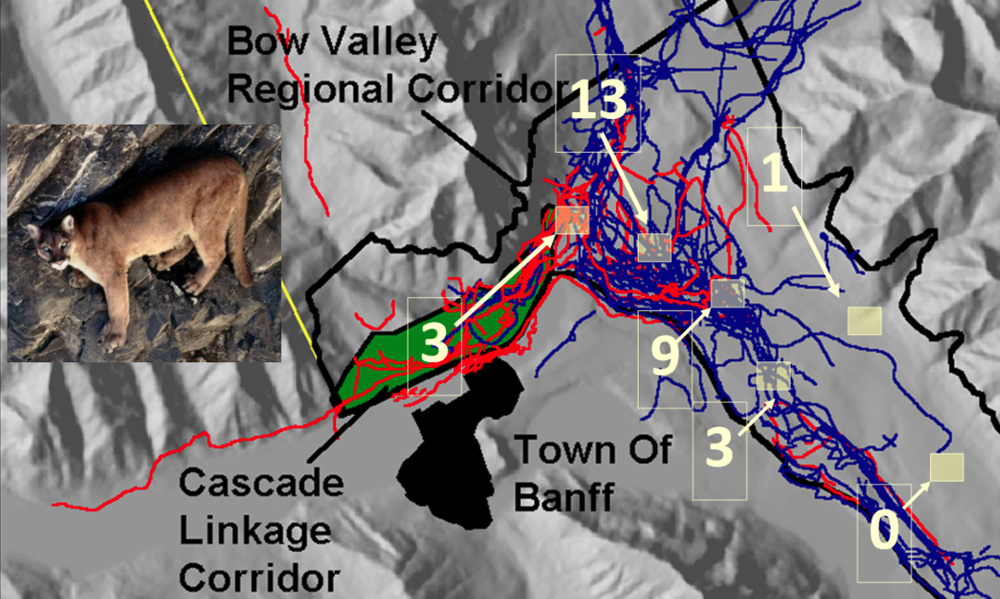

```{r setup , include=FALSE}
require(knitr)
knitr::opts_chunk$set(echo = TRUE)
r <- getOption("repos")
r["CRAN"] <- "https://ftp.osuosl.org/pub/cran/"
options(repos = r)
```


# Lab Objectives
•	Introduce students to R through and R studio, a Graphic User Interface (GUI) 
•	REVIEW basic principle of data management, data exploration and visualization, and basic statistical tests including t-tests, linear models, and regression. 
•	Introduce the concept of scripting to conduct statistical analyses. 
•	Introduce how to handle spatial data (Rasters, Vectors) using the R packages sp, raster.

# 1.0 Why R? R & R Studio
R is a free, open-source statistics software program. R is a command-line driven high-level software language, meaning a user enters code into the R console to make calculations, conduct analyses, etc. Unfortunately, this style of software can be daunting for beginners, who are not familiar with the commands or syntax of R – and because R is free the help files can sometimes be less than helpful, but they are improving. R Commander smoothes much of this confusion and aggravation by providing a point-and-click window environment for new users to begin performing basic analyses. In addition to these user-friendly windows, you can also enter R code directly into the script window in R commander and click the submit button to run it. The script window serves as the R console. Note, however, this friendly environment may also sacrifice some of the flexibility of using the full R language and may become frustrating as you learn the R language.  In summary, there are 3 main reasons why the ecological world is moving to R; 
1) It is free, and has a growing and loyal on-line community of software developers continually improving and adding to its functionality – chances are, if you have to do a customized analysis, someone has already built a package to download and use.
2) Its becoming the statistical software of choice of ecologists and statisticians worldwide, and will carry your career for at least the next decade.
3) Most importantly, though, it is a fully customizable software platform (not a programming language) for conducting any analysis you need in your graduate research. 

R Resources
•	Website - http://www.r-project.org/index.html
•	The R-journal - http://journal.r-project.org/
•	Internet searching - http://www.rseek.org/

R studio https://www.rstudio.com 
Another of Hadley Wickham’s creations (along with ggplot2, Rmarkdown, etc), R studio is a RStudio is an integrated development environment (IDE) for R. 

# Preliminaries


## Find out about R
```{r}
R.Version()
citation()
```

# Objective 1.0 Cougar Track Count Analysis #####

First we will refresh our data exploration, summary statistic skills, and generalized linear modeling skills to review some basic foundations of statistics and R together. 

We will be using data on track counts of mountain lions/cougars in and around Banff National Park Alberta in the data file called **cougar.csv** 

The file **cougar.csv** contains data on cougar track counts from the Bow Valley of Banff National Park. Over 5 years, multiple cougars were snow tracked through various wildlife corridors surrounding the townsite of Banff (Duke et al., 2001), and the number of counts of tracks of cougars within 30m2 pixels was counted in one wildlife corridor. This resulted in some cells having multiple counts of cougar tracks and others having no counts. Park Managers wanted to know what habitat factors cougars needed for corridor use, and the dataset includes information about the count of cougar tracks and associated spatial covariates including slope, distance to cover, distance to roads and distance to trails. 


Duke, D. L., M. Hebblewhite, P. C. Paquet, C. Callaghan, and M. Percy. 2001. Restoration of a large carnivore corridor in Banff National Park. Pages 261-275 in D. S. Maehr, R. F. Noss, and J. L. Larkin, editors. Large mammal restoration: ecological and sociological challenges in the 21st century. Island Press, Washington.


Import the data csv 
```{r, cougar1}
cougar <- read.csv("Data/cougar.csv", header=TRUE, sep=",", na.strings="NA", dec=".", strip.white=TRUE)
head(cougar)
str(cougar)
table(cougar$Use, cougar$UseNonUse)

# Cougar data management 
## Let us convert the USENONUSE column to a factor for future analysis, and store it as as a factorUSE
cougar$factorUSE <- as.factor(cougar$UseNonUse)
```

## Cougar summary statistics
Lets calculate some basic summary statistics for the data set...
```{r, }
summary(cougar)
# ... by used and unused locations
install.packages("tidyverse")
library(tidyverse)

cougar_df <- as_tibble(cougar)

byUse <- group_by(cougar_df, UseNonUse)
summarise(byUse, slope = mean(Slope))
summarise(byUse, DistTrails = mean(AllTrails))
summarise(byUse, DistCover = mean(CoverDist))
summarise(byUse, DistRoads = mean(Roads))
```

## Cougar graphing
Lets visualize this differences with overlaid histograms for each variable.  The multhist function from the plotrix package does a nice job of doing this.
```{r, cougar3}
install.packages("plotrix")
library(plotrix)
# Use a 2x2 plotting matrix to see all of the histograms at once
par(mfrow = c(2,2))
multhist(list(cougar$AllTrails[cougar$factorUSE==1],cougar$AllTrails[cougar$factorUSE==0]), freq = TRUE, main = "Trails")
# I chose to put a legend in the upper right hand graph. 
# That's what the additional arguments in the line below specify.
multhist(list(cougar$CoverDist[cougar$factorUSE==1],cougar$CoverDist[cougar$factorUSE==0]), freq = TRUE, main = "Cover Distance", legend.text = c("Used", "Unused"), args.legend = list(bty = "n"))
multhist(list(cougar$Roads[cougar$factorUSE==1],cougar$Roads[cougar$factorUSE==0]), freq = TRUE, main = "Roads")
multhist(list(cougar$Slope[cougar$factorUSE==1],cougar$Slope[cougar$factorUSE==0]), freq = TRUE, main = "Slope")
```

### Cougar Boxplots
Box plots also do a good job of visualizing these differences. These are plotted in a similar fashion as above.
```{r, cougar4}
par(mfrow= c(2,2))
boxplot(AllTrails~factorUSE, ylab="Distance (m)", xlab="Used",main = "Trails", data=cougar)
boxplot(CoverDist~factorUSE, ylab="Distance (m)", xlab="Used", main = "Cover", data=cougar)
boxplot(Roads~factorUSE, ylab="Distance (m)", xlab="Used",main = "Roads", data=cougar)
boxplot(Slope~factorUSE, ylab="Slope", xlab="Used", main = "Slope", data=cougar)
```

## Cougar statistical tests
Test for significant differences in each of the covariates
```{r, cougar5}
t.test(AllTrails~factorUSE, alternative='two.sided', conf.level=.95, 
  var.equal=FALSE, data=cougar)
t.test(CoverDist~factorUSE, alternative='two.sided', conf.level=.95, 
  var.equal=FALSE, data=cougar)
t.test(Roads~factorUSE, alternative='two.sided', conf.level=.95, 
  var.equal=FALSE, data=cougar)
t.test(Slope~factorUSE, alternative='two.sided', conf.level=.95, 
  var.equal=FALSE, data=cougar)
```

## Cougar statistical analyses - linear models
First, letes create a data set of only the used locations
```{r, cougar6}
USEonly <- subset(cougar, subset=UseNonUse == 1)
# Construct linear models of track counts as a function of 4 covariates
# Distance to trails model
trails <- glm(Use ~ AllTrails, family=gaussian(identity), data=USEonly)
summary(trails)
# Slope model
slope <- glm(Use ~ Slope, family=gaussian(identity), data=USEonly)
summary(slope)
# Distance to cover model
cover <- glm(Use ~ CoverDist, family=gaussian(identity), data=USEonly)
summary(cover)
# Distance to roads model
roads <- glm(Use ~ Roads, family=gaussian(identity), data=USEonly)
summary(roads)
```

But these tests require the assumption of normality for the response variable, use. Is that reasonable? Lets test track counts for normality
```{r, cougar7}
# Visualize with a histogram
par(mfrow= c(1,1))
hist(USEonly$Use, scale="frequency", breaks="Sturges", col="darkgray")
## not really that normal
shapiro.test(USEonly$Use)
# Visualize with a histogram
```
clearly, the answer is NO. This means we need to consider OTHER forms of generalized linear models, or transformation of the response variable, here, USE. 

Lets re-fit linear models with a ln transform, first make the ln transform, and then refit the linear models with the transformed use
```{r, cougar8}
USEonly$lnUSE <- with(USEonly, log(Use))
hist(USEonly$lnUSE) ## a bit more normal

### Now re-fit the models
# Distance to trails model
ln.trails <- glm(lnUSE ~ AllTrails, family=gaussian(identity), data=USEonly)
summary(ln.trails)
# Slope model
ln.slope <- glm(lnUSE ~ Slope, family=gaussian(identity), data=USEonly)
summary(ln.slope)
# Distance to cover model
ln.cover <- glm(lnUSE ~ CoverDist, family=gaussian(identity), data=USEonly)
summary(ln.cover)
# Distance to roads model
ln.roads <- glm(lnUSE ~ Roads, family=gaussian(identity), data=USEonly)
summary(ln.roads)
```

Next, lets switch back to the complete data set, and then re-do the Shapiro-Wilk Test and make another histogram for all of the data.
```{r, cougar9}
shapiro.test(cougar$Use)
hist(cougar$Use, scale="frequency", breaks="Sturges", col="darkgray")
```
Clearly these data are still not normal, and so it might be useful to think of categorizing these data as USED or NOT USED, in a binary fashion, and using logistic regression of the use = 1 and not use = 0.  Thus, next we will use logistic regression to model the log-odds of USE for each of the 4 covariates

```{r, cougarlogit1}
# Trails model
logitTrails <- glm(UseNonUse ~ AllTrails, family=binomial(logit), data=cougar)
summary(logitTrails)
# Slope model
logitSlope <- glm(UseNonUse ~ Slope, family=binomial(logit),   data=cougar)
summary(logitSlope)
# Cover model
logitCover <- glm(UseNonUse~ CoverDist, family=binomial(logit),   data=cougar)
summary(logitCover)
# Roads model
logitRoads <- glm(UseNonUse ~ Roads, family=binomial(logit),  data=cougar)
summary(logitRoads)
```

## Logistic Regression Visualization - graphing
```{r, cougarLogit2}
install.packages("ggplot2")
library(ggplot2)
ggplot(cougar, aes(x=Slope, y=UseNonUse)) + geom_rug() + stat_smooth(method="glm", method.args=list(family="binomial"))
ggplot(cougar, aes(x=CoverDist, y=UseNonUse)) + geom_rug() + stat_smooth(method="glm", method.args=list(family="binomial"))
```

So, to review, we have reviewed some basic data visualization steps (boxplots, histograms, etc), basic summary statistics, basic statistical analyses (t-tests, tests for normality, generalized linear models), and considered a simple dataset with different ways of thinking about animal use of space and 4 spatial covariates. 

But, how did we build our dataset of things like distance to cover, distance to trails, etc?  Next, we will move to understanding and exploring spatial data in R. 

# Objective 2 - exploring SPATIAL data in R. 

This semester we will use this nifty little wrapper package Dan Eacker adapted from here: https://gist.github.com/stevenworthington/3178163
## Define function to install and load required packages
```{r, ipakfunction}
ipak <- function(pkg){
  new.pkg <- pkg[!(pkg %in% installed.packages()[, "Package"])]
  if (length(new.pkg)) 
    install.packages(new.pkg, dependencies = TRUE)
  sapply(pkg, require, character.only = TRUE)
}

#load or install these packages:
packages <- c("ks", "lattice", "adehabitatHR", "maptools", "foreign", "plot3D","rasterVis", "colorRamps","sf","terra", "tmap")

#run function to install packages - e.g., library command
ipak(packages)
```

## Working Directly with Shapefiles in R 

Read in shapefiles with options to use package sf or terr
```{r, obj2}
# reading in shapefiles (terra package -- S4 Class SpatVector)
elc_habitat_terra<-vect("Data/elc_habitat.shp")
humanaccess_terra<-vect("Data/humanacess.shp")
mcp2_terra<-vect("Data/mcp2.shp")
wolfyht_terra<-vect("Data/wolfyht.shp")

# reading in shapefiles (sf package -- S3 Class Sf Data Frame) 
elc_habitat_sf <- st_read("Data/elc_habitat.shp")
humanaccess_sf<-st_read("Data/humanacess.shp") 
mcp2_sf<-st_read("Data/mcp2.shp")
wolfyht_sf<-st_read("Data/wolfyht.shp")
#can also use read_sf() - the functions do the same thing except st_read prints


# make a very basic plot of SpatVector after resetting graphical parameters
par(mfrow= c(1,1))
plot(elc_habitat_terra)
plot(wolfyht_terra)

# for plotting sf objects we can use the package tmap()
# first set the mode to either "plot" for static map or "view" for interactive map
tmap_mode("plot") 

tm_shape(elc_habitat_sf) + tm_sf()

# look at the class of the shapefile (SpatVector) vs the sf object
class(elc_habitat_terra)

class(elc_habitat_sf)


# look at structure of SpatVector
#str(elc_habitat)

# look at first 20 rows of data for SpatVector
head(elc_habitat_terra, n=20)

# look at first 20 rows of data for sf object
head(elc_habitat_sf, n=20)

# look at the projection of the SpatVector 
crs(elc_habitat_terra,proj = TRUE)
crs(wolfyht_terra, proj = TRUE)


# look at the projection of the sf object
st_crs(elc_habitat_sf)

```

Sometimes we will need to change the projection of the shapefile to another projection (package sf or terra). To change the projection we need to use the approrpiate epsg (Geodetic Parameter Dataset) code that represents your new projection. 

Find a list of these spatial reference codes here: http://spatialreference.org/ref/epsg/

```{r, obj3}
#changing the projection for SpatVector (terra)
elc_habitat_terra <- project(elc_habitat_terra, "+proj=longlat +datum=NAD83 +no_defs +ellps=GRS80 +towgs84=0,0,0")

# check new projection in geographic coordinate system WGS84
crs(elc_habitat_terra, proj = TRUE)

#changing the projection for sf object
st_transform(elc_habitat_sf, "+proj=longlat +datum=NAD83 +no_defs +ellps=GRS80 +towgs84=0,0,0")


###I'm confused about the code below -- it doesnt seem to change it from what it was previously
# reset projection back to what is was previously
#elc_habitat <-  spTransform(elc_habitat, CRS("+proj=longlat +datum=NAD83 +no_defs +ellps=GRS80 +towgs84=0,0,0"))

# look at the projection of the shapefile 
#elc_habitat@proj4string@projargs

# another way to change it back to previous 
#elc_habitat <-  spTransform(elc_habitat, CRS("+proj=utm +zone=11 +datum=NAD83 +units=m +no_defs +ellps=GRS80 +towgs84=0,0,0"))

#write SpatVector to files
writeVector(elc_habitat_terra, here::here("Output","elc_habitat_NEW_terra"), filetype = "ESRI Shapefile", overwrite = TRUE)

#write sf object to files
st_write(elc_habitat_sf, here::here("Output","elc_habitat_NEW_sf"),driver = "ESRI Shapefile", delete_layer =  TRUE)

#write sf same thing as st_write with different defaults
write_sf(elc_habitat_sf, here::here("Output","elc_habitat_NEW_writesf"),driver = "ESRI Shapefile", delete_layer =  TRUE)
```

## Extents
Spatial data objects have a spatial extent, in geographic space, that they occupy.  To look at the spatial extent of the SpatVector,we use ?ext()
```{r, extent}
ext(elc_habitat_terra)
ext(wolfyht_terra)

st_bbox(elc_habitat_sf)
st_bbox(wolfyht_sf)
```
We will learn later how to harmonize datasets of different spatial extents. 

# Working with Rasters in R 
```{r, obj4}
par(mfrow= c(1,1)) ## reset graphical parameters

# reading in raster files (terra package)
deer_w<-rast("Data/deer_w2.tif")
moose_w<-rast("Data/moose_w2.tif") ## missing moose
elk_w<-rast("Data/elk_w2.tif")
sheep_w<-rast("Data/sheep_w2.tif") ## missing sheep
goat_w<-rast("Data/goat_w2.tif")
wolf_w<-rast("Data/wolf_w2.tif")#
elevation2<-rast("Data/Elevation2.tif") #resampled
disthumanaccess2<-rast("Data/DistFromHumanAccess2.tif") #resampled

# make a very basic plot of raster
plot(deer_w)

# look at the class of the raster
class(deer_w)

# look at basic raster summary
deer_w

# look at raster data -- not sure how to do this one with terra
#view(deer_w)

# look at structure of raster
str(deer_w)

# look at the projection of the raster (note the use of "@" instead of "$")
crs(deer_w, proj = TRUE)

# look at the spatial extent of the raster
ext(deer_w)

# look at the resolution of the raster
res(deer_w)
```

And if we need to change the projection of the raster to another projection (package rgdal) - note for the Tutorial I've masked these out # because they take a LONG time. 
```{r, obj5}
#deer_w2 <- terra::project(deer_w, crs="+init=epsg:4326")

## or try this the same way we did above

#deer_w2 <- terra::project(deer_w, crs="+proj=longlat +datum=NAD83 +no_defs +ellps=GRS80 +towgs84=0,0,0")

#check projection of the raster
crs(deer_w, proj = TRUE)

#change it back to what it was using another raster layers projection
#deer_w <- projectRaster(deer_w2, wolf_w)

#check projection of the raster
crs(deer_w, proj = TRUE)
```

## Creating a Raster Stack

One of the GREAT things about doing GIS in R is the ability to create a consistent raster stack of rasters of the same projection, extent, etc.  LEts create a raster stack!

```{r, obj6}
all.rasters<-c(deer_w, moose_w, elk_w, sheep_w, goat_w, elevation2, disthumanaccess2)

plot(all.rasters)

#check class
class(all.rasters)
```

We can also sometimes need to export raster files to other formats such as a GeoTiff. 

```{r, obj7}
writeRaster(deer_w, "Output/new_deer.tiff", filetype = "GTiff", overwrite=TRUE)
```


# Mapping with Mapview

Learn about mapview here: https://r-spatial.github.io/mapview/articles/articles/mapview_02-advanced.html 

And also learn about different map types here
http://leaflet-extras.github.io/leaflet-providers/preview/

**Note, I had unexplained errors with the latest version of Mapview that were creating all sorts of problems both viewing the wolf telemetry points, and, rendering the .html through R markdown.  I found the solution here :**
https://github.com/r-spatial/mapview/issues/312

```{r mapview, }
install.packages("remotes")
library(remotes)
remotes::install_github("r-spatial/mapview")
library(mapview)
mapView(wolfyht_terra, layer.name = , zcol="NAME", native.crs = FALSE, legend = TRUE, cex=5, lwd=2, map.type = "Esri.DeLorme") + mcp2_terra
```

```{r mapview2, }  
mapView(wolfyht, zcol="NAME", legend = TRUE, cex=5, lwd=2, map.type = "Esri.WorldImagery") + mcp2_terra

## Open Topo Map
mapView(wolfyht, zcol="NAME", legend = TRUE, cex=5, lwd=2, map.type = "OpenTopoMap") + mcp2_terra

## Esri World Topo Map
mapView(wolfyht, zcol="NAME", legend = TRUE, cex=5, lwd=2, map.type = "Esri.WorldTopoMap") + mcp2_terra
```


