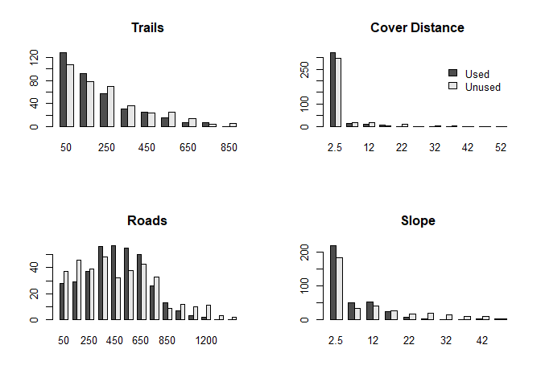
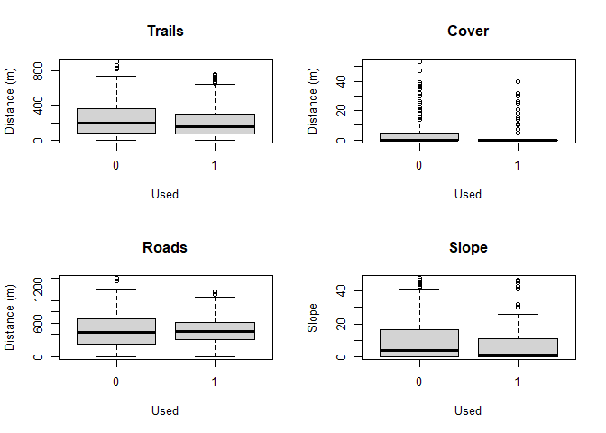
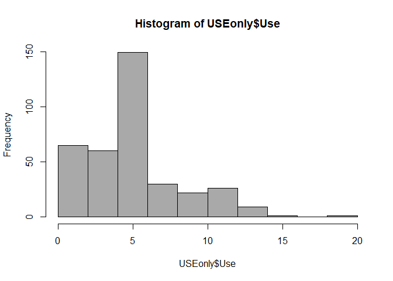
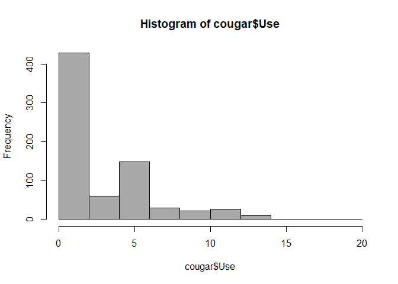
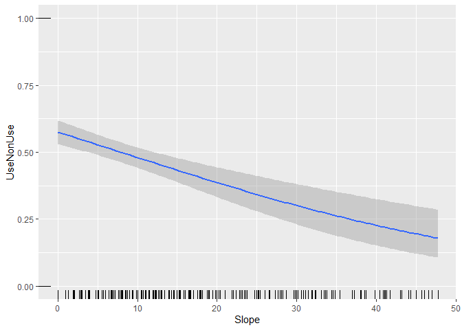
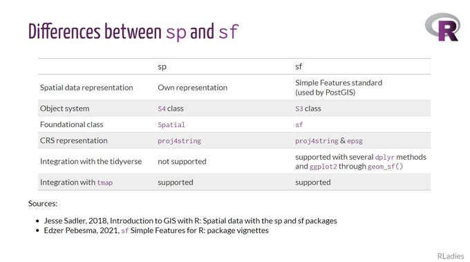
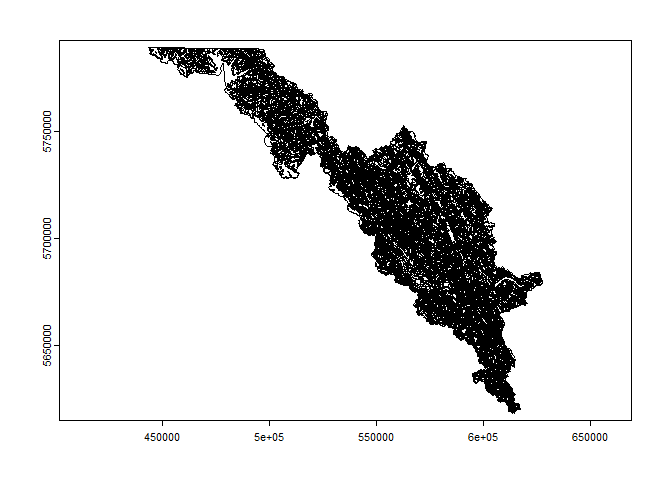

Lab 1 2023
================
Mark Hebblewhite
1/24/2023 test2

# Lab Objectives

• Introduce students to R through and R studio, a Graphic User Interface
(GUI) • REVIEW basic principle of data management, data exploration and
visualization, and basic statistical tests including t-tests, linear
models, and regression. • Introduce the concept of scripting to conduct
statistical analyses. • Introduce how to handle spatial data (Rasters,
Vectors) using the R packages sp, raster.

# 1.0 Why R? R & R Studio

R is a free, open-source statistics software program. R is a
command-line driven high-level software language, meaning a user enters
code into the R console to make calculations, conduct analyses, etc.
Unfortunately, this style of software can be daunting for beginners, who
are not familiar with the commands or syntax of R – and because R is
free the help files can sometimes be less than helpful, but they are
improving. R Commander smoothes much of this confusion and aggravation
by providing a point-and-click window environment for new users to begin
performing basic analyses. In addition to these user-friendly windows,
you can also enter R code directly into the script window in R commander
and click the submit button to run it. The script window serves as the R
console. Note, however, this friendly environment may also sacrifice
some of the flexibility of using the full R language and may become
frustrating as you learn the R language. In summary, there are 3 main
reasons why the ecological world is moving to R; 1) It is free, and has
a growing and loyal on-line community of software developers continually
improving and adding to its functionality – chances are, if you have to
do a customized analysis, someone has already built a package to
download and use. 2) Its becoming the statistical software of choice of
ecologists and statisticians worldwide, and will carry your career for
at least the next decade. 3) Most importantly, though, it is a fully
customizable software platform (not a programming language) for
conducting any analysis you need in your graduate research.

R Resources • Website - <http://www.r-project.org/index.html> • The
R-journal - <http://journal.r-project.org/> • Internet searching -
<http://www.rseek.org/>

R studio <https://www.rstudio.com> Another of Hadley Wickham’s creations
(along with ggplot2, Rmarkdown, etc), R studio is a RStudio is an
integrated development environment (IDE) for R.

# Preliminaries

## Find out about R

``` r
R.Version()
```

    ## $platform
    ## [1] "x86_64-w64-mingw32"
    ## 
    ## $arch
    ## [1] "x86_64"
    ## 
    ## $os
    ## [1] "mingw32"
    ## 
    ## $crt
    ## [1] "ucrt"
    ## 
    ## $system
    ## [1] "x86_64, mingw32"
    ## 
    ## $status
    ## [1] ""
    ## 
    ## $major
    ## [1] "4"
    ## 
    ## $minor
    ## [1] "2.2"
    ## 
    ## $year
    ## [1] "2022"
    ## 
    ## $month
    ## [1] "10"
    ## 
    ## $day
    ## [1] "31"
    ## 
    ## $`svn rev`
    ## [1] "83211"
    ## 
    ## $language
    ## [1] "R"
    ## 
    ## $version.string
    ## [1] "R version 4.2.2 (2022-10-31 ucrt)"
    ## 
    ## $nickname
    ## [1] "Innocent and Trusting"

``` r
citation()
```

    ## 
    ## To cite R in publications use:
    ## 
    ##   R Core Team (2022). R: A language and environment for statistical
    ##   computing. R Foundation for Statistical Computing, Vienna, Austria.
    ##   URL https://www.R-project.org/.
    ## 
    ## A BibTeX entry for LaTeX users is
    ## 
    ##   @Manual{,
    ##     title = {R: A Language and Environment for Statistical Computing},
    ##     author = {{R Core Team}},
    ##     organization = {R Foundation for Statistical Computing},
    ##     address = {Vienna, Austria},
    ##     year = {2022},
    ##     url = {https://www.R-project.org/},
    ##   }
    ## 
    ## We have invested a lot of time and effort in creating R, please cite it
    ## when using it for data analysis. See also 'citation("pkgname")' for
    ## citing R packages.

# Objective 1.0 Cougar Track Count Analysis

First we will refresh our data exploration, summary statistic skills,
and generalized linear modeling skills to review some basic foundations
of statistics and R together.

We will be using data on track counts of mountain lions/cougars in and
around Banff National Park Alberta in the data file called
**cougar.csv**

The file **cougar.csv** contains data on cougar track counts from the
Bow Valley of Banff National Park. Over 5 years, multiple cougars were
snow tracked through various wildlife corridors surrounding the townsite
of Banff (Duke et al., 2001), and the number of counts of tracks of
cougars within 30m2 pixels was counted in one wildlife corridor. This
resulted in some cells having multiple counts of cougar tracks and
others having no counts. Park Managers wanted to know what habitat
factors cougars needed for corridor use, and the dataset includes
information about the count of cougar tracks and associated spatial
covariates including slope, distance to cover, distance to roads and
distance to trails.

 Duke, D. L., M.
Hebblewhite, P. C. Paquet, C. Callaghan, and M. Percy. 2001. Restoration
of a large carnivore corridor in Banff National Park. Pages 261-275 in
D. S. Maehr, R. F. Noss, and J. L. Larkin, editors. Large mammal
restoration: ecological and sociological challenges in the 21st century.
Island Press, Washington.

Import the data csv

``` r
cougar <- read.csv("Data/cougar.csv", header=TRUE, sep=",", na.strings="NA", dec=".", strip.white=TRUE)
head(cougar)
```

    ##   Use UseNonUse     Slope CoverDist Roads AllTrails
    ## 1   0         0  9.462322         0   787       228
    ## 2   0         0 39.856209         0   690       247
    ## 3   0         0  0.000000         7   150       153
    ## 4   0         0 11.386165         0    30       671
    ## 5   0         0 10.555381         0   457        42
    ## 6   0         0  7.653049         0   335       192

``` r
str(cougar)
```

    ## 'data.frame':    726 obs. of  6 variables:
    ##  $ Use      : int  0 0 0 0 0 0 0 0 0 0 ...
    ##  $ UseNonUse: int  0 0 0 0 0 0 0 0 0 0 ...
    ##  $ Slope    : num  9.46 39.86 0 11.39 10.56 ...
    ##  $ CoverDist: int  0 0 7 0 0 0 0 0 16 0 ...
    ##  $ Roads    : int  787 690 150 30 457 335 741 711 630 283 ...
    ##  $ AllTrails: int  228 247 153 671 42 192 60 42 300 134 ...

``` r
table(cougar$Use, cougar$UseNonUse)
```

    ##     
    ##        0   1
    ##   0  363   0
    ##   1    0  31
    ##   2    0  34
    ##   3    0  28
    ##   4    0  32
    ##   5    0  28
    ##   6    0 121
    ##   7    0  16
    ##   8    0  14
    ##   9    0  10
    ##   10   0  12
    ##   11   0   8
    ##   12   0  18
    ##   13   0   4
    ##   14   0   5
    ##   15   0   1
    ##   19   0   1

``` r
# Cougar data management 
## Let us convert the USENONUSE column to a factor for future analysis, and store it as as a factorUSE
cougar$factorUSE <- as.factor(cougar$UseNonUse)
```

## Cougar summary statistics

Lets calculate some basic summary statistics for the data set…

``` r
summary(cougar)
```

    ##       Use           UseNonUse       Slope          CoverDist     
    ##  Min.   : 0.000   Min.   :0.0   Min.   : 0.000   Min.   : 0.000  
    ##  1st Qu.: 0.000   1st Qu.:0.0   1st Qu.: 0.000   1st Qu.: 0.000  
    ##  Median : 0.500   Median :0.5   Median : 2.134   Median : 0.000  
    ##  Mean   : 2.853   Mean   :0.5   Mean   : 8.111   Mean   : 2.959  
    ##  3rd Qu.: 6.000   3rd Qu.:1.0   3rd Qu.:12.773   3rd Qu.: 0.000  
    ##  Max.   :19.000   Max.   :1.0   Max.   :47.730   Max.   :53.000  
    ##      Roads          AllTrails     factorUSE
    ##  Min.   :   0.0   Min.   :  0.0   0:363    
    ##  1st Qu.: 260.5   1st Qu.: 67.0   1:363    
    ##  Median : 450.0   Median :175.0            
    ##  Mean   : 465.5   Mean   :224.8            
    ##  3rd Qu.: 641.0   3rd Qu.:323.0            
    ##  Max.   :1400.0   Max.   :899.0

``` r
# ... by used and unused locations
install.packages("tidyverse")
```

    ## package 'tidyverse' successfully unpacked and MD5 sums checked
    ## 
    ## The downloaded binary packages are in
    ##  C:\Users\Administrator.KJLWS11\AppData\Local\Temp\Rtmpgt2VMg\downloaded_packages

``` r
library(tidyverse)
```

    ## ── Attaching packages ─────────────────────────────────────── tidyverse 1.3.2 ──
    ## ✔ ggplot2 3.4.0      ✔ purrr   1.0.0 
    ## ✔ tibble  3.1.8      ✔ dplyr   1.0.10
    ## ✔ tidyr   1.2.1      ✔ stringr 1.5.0 
    ## ✔ readr   2.1.3      ✔ forcats 0.5.2 
    ## ── Conflicts ────────────────────────────────────────── tidyverse_conflicts() ──
    ## ✖ dplyr::filter() masks stats::filter()
    ## ✖ dplyr::lag()    masks stats::lag()

``` r
cougar_df <- as_tibble(cougar)

byUse <- group_by(cougar_df, UseNonUse)
summarise(byUse, slope = mean(Slope))
```

    ## # A tibble: 2 × 2
    ##   UseNonUse slope
    ##       <int> <dbl>
    ## 1         0 10.3 
    ## 2         1  5.93

``` r
summarise(byUse, DistTrails = mean(AllTrails))
```

    ## # A tibble: 2 × 2
    ##   UseNonUse DistTrails
    ##       <int>      <dbl>
    ## 1         0       244.
    ## 2         1       206.

``` r
summarise(byUse, DistCover = mean(CoverDist))
```

    ## # A tibble: 2 × 2
    ##   UseNonUse DistCover
    ##       <int>     <dbl>
    ## 1         0      3.84
    ## 2         1      2.07

``` r
summarise(byUse, DistRoads = mean(Roads))
```

    ## # A tibble: 2 × 2
    ##   UseNonUse DistRoads
    ##       <int>     <dbl>
    ## 1         0      474.
    ## 2         1      457.

## Cougar graphing

Lets visualize this differences with overlaid histograms for each
variable. The multhist function from the plotrix package does a nice job
of doing this.

``` r
install.packages("plotrix")
```

    ## package 'plotrix' successfully unpacked and MD5 sums checked
    ## 
    ## The downloaded binary packages are in
    ##  C:\Users\Administrator.KJLWS11\AppData\Local\Temp\Rtmpgt2VMg\downloaded_packages

``` r
library(plotrix)
# Use a 2x2 plotting matrix to see all of the histograms at once
par(mfrow = c(2,2))
multhist(list(cougar$AllTrails[cougar$factorUSE==1],cougar$AllTrails[cougar$factorUSE==0]), freq = TRUE, main = "Trails")
# I chose to put a legend in the upper right hand graph. 
# That's what the additional arguments in the line below specify.
multhist(list(cougar$CoverDist[cougar$factorUSE==1],cougar$CoverDist[cougar$factorUSE==0]), freq = TRUE, main = "Cover Distance", legend.text = c("Used", "Unused"), args.legend = list(bty = "n"))
multhist(list(cougar$Roads[cougar$factorUSE==1],cougar$Roads[cougar$factorUSE==0]), freq = TRUE, main = "Roads")
multhist(list(cougar$Slope[cougar$factorUSE==1],cougar$Slope[cougar$factorUSE==0]), freq = TRUE, main = "Slope")
```

<!-- -->

### Cougar Boxplots

Box plots also do a good job of visualizing these differences. These are
plotted in a similar fashion as above.

``` r
par(mfrow= c(2,2))
boxplot(AllTrails~factorUSE, ylab="Distance (m)", xlab="Used",main = "Trails", data=cougar)
boxplot(CoverDist~factorUSE, ylab="Distance (m)", xlab="Used", main = "Cover", data=cougar)
boxplot(Roads~factorUSE, ylab="Distance (m)", xlab="Used",main = "Roads", data=cougar)
boxplot(Slope~factorUSE, ylab="Slope", xlab="Used", main = "Slope", data=cougar)
```

<!-- -->

## Cougar statistical tests

Test for significant differences in each of the covariates

``` r
t.test(AllTrails~factorUSE, alternative='two.sided', conf.level=.95, 
  var.equal=FALSE, data=cougar)
```

    ## 
    ##  Welch Two Sample t-test
    ## 
    ## data:  AllTrails by factorUSE
    ## t = 2.6896, df = 715.58, p-value = 0.00732
    ## alternative hypothesis: true difference in means between group 0 and group 1 is not equal to 0
    ## 95 percent confidence interval:
    ##  10.13185 64.90396
    ## sample estimates:
    ## mean in group 0 mean in group 1 
    ##        243.5399        206.0220

``` r
t.test(CoverDist~factorUSE, alternative='two.sided', conf.level=.95, 
  var.equal=FALSE, data=cougar)
```

    ## 
    ##  Welch Two Sample t-test
    ## 
    ## data:  CoverDist by factorUSE
    ## t = 3.3686, df = 604.85, p-value = 0.0008037
    ## alternative hypothesis: true difference in means between group 0 and group 1 is not equal to 0
    ## 95 percent confidence interval:
    ##  0.7374901 2.7997000
    ## sample estimates:
    ## mean in group 0 mean in group 1 
    ##        3.842975        2.074380

``` r
t.test(Roads~factorUSE, alternative='two.sided', conf.level=.95, 
  var.equal=FALSE, data=cougar)
```

    ## 
    ##  Welch Two Sample t-test
    ## 
    ## data:  Roads by factorUSE
    ## t = 0.86435, df = 679.54, p-value = 0.3877
    ## alternative hypothesis: true difference in means between group 0 and group 1 is not equal to 0
    ## 95 percent confidence interval:
    ##  -22.24071  57.22143
    ## sample estimates:
    ## mean in group 0 mean in group 1 
    ##        474.2039        456.7135

``` r
t.test(Slope~factorUSE, alternative='two.sided', conf.level=.95, 
  var.equal=FALSE, data=cougar)
```

    ## 
    ##  Welch Two Sample t-test
    ## 
    ## data:  Slope by factorUSE
    ## t = 5.4158, df = 627.87, p-value = 8.7e-08
    ## alternative hypothesis: true difference in means between group 0 and group 1 is not equal to 0
    ## 95 percent confidence interval:
    ##  2.774890 5.931965
    ## sample estimates:
    ## mean in group 0 mean in group 1 
    ##       10.287312        5.933884

## Cougar statistical analyses - linear models

First, letes create a data set of only the used locations

``` r
USEonly <- subset(cougar, subset=UseNonUse == 1)
# Construct linear models of track counts as a function of 4 covariates
# Distance to trails model
trails <- glm(Use ~ AllTrails, family=gaussian(identity), data=USEonly)
summary(trails)
```

    ## 
    ## Call:
    ## glm(formula = Use ~ AllTrails, family = gaussian(identity), data = USEonly)
    ## 
    ## Deviance Residuals: 
    ##    Min      1Q  Median      3Q     Max  
    ## -5.120  -2.106  -0.033   1.054  13.009  
    ## 
    ## Coefficients:
    ##               Estimate Std. Error t value Pr(>|t|)    
    ## (Intercept)  6.1910009  0.2541896  24.356   <2e-16 ***
    ## AllTrails   -0.0023578  0.0009354  -2.521   0.0121 *  
    ## ---
    ## Signif. codes:  0 '***' 0.001 '**' 0.01 '*' 0.05 '.' 0.1 ' ' 1
    ## 
    ## (Dispersion parameter for gaussian family taken to be 9.972573)
    ## 
    ##     Null deviance: 3663.5  on 362  degrees of freedom
    ## Residual deviance: 3600.1  on 361  degrees of freedom
    ## AIC: 1869
    ## 
    ## Number of Fisher Scoring iterations: 2

``` r
# Slope model
slope <- glm(Use ~ Slope, family=gaussian(identity), data=USEonly)
summary(slope)
```

    ## 
    ## Call:
    ## glm(formula = Use ~ Slope, family = gaussian(identity), data = USEonly)
    ## 
    ## Deviance Residuals: 
    ##     Min       1Q   Median       3Q      Max  
    ## -4.7694  -2.6853   0.2811   0.3147  13.3114  
    ## 
    ## Coefficients:
    ##             Estimate Std. Error t value Pr(>|t|)    
    ## (Intercept) 5.685274   0.204401   27.81   <2e-16 ***
    ## Slope       0.003364   0.019816    0.17    0.865    
    ## ---
    ## Signif. codes:  0 '***' 0.001 '**' 0.01 '*' 0.05 '.' 0.1 ' ' 1
    ## 
    ## (Dispersion parameter for gaussian family taken to be 10.14728)
    ## 
    ##     Null deviance: 3663.5  on 362  degrees of freedom
    ## Residual deviance: 3663.2  on 361  degrees of freedom
    ## AIC: 1875.3
    ## 
    ## Number of Fisher Scoring iterations: 2

``` r
# Distance to cover model
cover <- glm(Use ~ CoverDist, family=gaussian(identity), data=USEonly)
summary(cover)
```

    ## 
    ## Call:
    ## glm(formula = Use ~ CoverDist, family = gaussian(identity), data = USEonly)
    ## 
    ## Deviance Residuals: 
    ##     Min       1Q   Median       3Q      Max  
    ## -4.8123  -1.9863   0.1877   1.0137  13.1877  
    ## 
    ## Coefficients:
    ##             Estimate Std. Error t value Pr(>|t|)    
    ## (Intercept)  5.81233    0.17904  32.464   <2e-16 ***
    ## CoverDist   -0.05163    0.03162  -1.633    0.103    
    ## ---
    ## Signif. codes:  0 '***' 0.001 '**' 0.01 '*' 0.05 '.' 0.1 ' ' 1
    ## 
    ## (Dispersion parameter for gaussian family taken to be 10.07372)
    ## 
    ##     Null deviance: 3663.5  on 362  degrees of freedom
    ## Residual deviance: 3636.6  on 361  degrees of freedom
    ## AIC: 1872.6
    ## 
    ## Number of Fisher Scoring iterations: 2

``` r
# Distance to roads model
roads <- glm(Use ~ Roads, family=gaussian(identity), data=USEonly)
summary(roads)
```

    ## 
    ## Call:
    ## glm(formula = Use ~ Roads, family = gaussian(identity), data = USEonly)
    ## 
    ## Deviance Residuals: 
    ##     Min       1Q   Median       3Q      Max  
    ## -4.8972  -2.5408   0.2199   0.5703  13.2917  
    ## 
    ## Coefficients:
    ##               Estimate Std. Error t value Pr(>|t|)    
    ## (Intercept)  5.9166147  0.3654078   16.19   <2e-16 ***
    ## Roads       -0.0004628  0.0007115   -0.65    0.516    
    ## ---
    ## Signif. codes:  0 '***' 0.001 '**' 0.01 '*' 0.05 '.' 0.1 ' ' 1
    ## 
    ## (Dispersion parameter for gaussian family taken to be 10.13621)
    ## 
    ##     Null deviance: 3663.5  on 362  degrees of freedom
    ## Residual deviance: 3659.2  on 361  degrees of freedom
    ## AIC: 1874.9
    ## 
    ## Number of Fisher Scoring iterations: 2

But these tests require the assumption of normality for the response
variable, use. Is that reasonable? Lets test track counts for normality

``` r
# Visualize with a histogram
par(mfrow= c(1,1))
hist(USEonly$Use, scale="frequency", breaks="Sturges", col="darkgray")
```

    ## Warning in plot.window(xlim, ylim, "", ...): "scale" is not a graphical
    ## parameter

    ## Warning in title(main = main, sub = sub, xlab = xlab, ylab = ylab, ...): "scale"
    ## is not a graphical parameter

    ## Warning in axis(1, ...): "scale" is not a graphical parameter

    ## Warning in axis(2, at = yt, ...): "scale" is not a graphical parameter

<!-- -->

``` r
## not really that normal
shapiro.test(USEonly$Use)
```

    ## 
    ##  Shapiro-Wilk normality test
    ## 
    ## data:  USEonly$Use
    ## W = 0.92147, p-value = 7.473e-13

``` r
# Visualize with a histogram
```

clearly, the answer is NO. This means we need to consider OTHER forms of
generalized linear models, or transformation of the response variable,
here, USE.

Lets re-fit linear models with a ln transform, first make the ln
transform, and then refit the linear models with the transformed use

``` r
USEonly$lnUSE <- with(USEonly, log(Use))
hist(USEonly$lnUSE) ## a bit more normal
```

<!-- -->

``` r
### Now re-fit the models
# Distance to trails model
ln.trails <- glm(lnUSE ~ AllTrails, family=gaussian(identity), data=USEonly)
summary(ln.trails)
```

    ## 
    ## Call:
    ## glm(formula = lnUSE ~ AllTrails, family = gaussian(identity), 
    ##     data = USEonly)
    ## 
    ## Deviance Residuals: 
    ##     Min       1Q   Median       3Q      Max  
    ## -1.6225  -0.2778   0.1812   0.3611   1.3439  
    ## 
    ## Coefficients:
    ##               Estimate Std. Error t value Pr(>|t|)    
    ## (Intercept)  1.6345317  0.0541846  30.166   <2e-16 ***
    ## AllTrails   -0.0003999  0.0001994  -2.006   0.0456 *  
    ## ---
    ## Signif. codes:  0 '***' 0.001 '**' 0.01 '*' 0.05 '.' 0.1 ' ' 1
    ## 
    ## (Dispersion parameter for gaussian family taken to be 0.4531516)
    ## 
    ##     Null deviance: 165.41  on 362  degrees of freedom
    ## Residual deviance: 163.59  on 361  degrees of freedom
    ## AIC: 746.82
    ## 
    ## Number of Fisher Scoring iterations: 2

``` r
# Slope model
ln.slope <- glm(lnUSE ~ Slope, family=gaussian(identity), data=USEonly)
summary(ln.slope)
```

    ## 
    ## Call:
    ## glm(formula = lnUSE ~ Slope, family = gaussian(identity), data = USEonly)
    ## 
    ## Deviance Residuals: 
    ##     Min       1Q   Median       3Q      Max  
    ## -1.5607  -0.4340   0.2311   0.2707   1.3852  
    ## 
    ## Coefficients:
    ##             Estimate Std. Error t value Pr(>|t|)    
    ## (Intercept)  1.56068    0.04343  35.938   <2e-16 ***
    ## Slope       -0.00144    0.00421  -0.342    0.732    
    ## ---
    ## Signif. codes:  0 '***' 0.001 '**' 0.01 '*' 0.05 '.' 0.1 ' ' 1
    ## 
    ## (Dispersion parameter for gaussian family taken to be 0.4580528)
    ## 
    ##     Null deviance: 165.41  on 362  degrees of freedom
    ## Residual deviance: 165.36  on 361  degrees of freedom
    ## AIC: 750.72
    ## 
    ## Number of Fisher Scoring iterations: 2

``` r
# Distance to cover model
ln.cover <- glm(lnUSE ~ CoverDist, family=gaussian(identity), data=USEonly)
summary(ln.cover)
```

    ## 
    ## Call:
    ## glm(formula = lnUSE ~ CoverDist, family = gaussian(identity), 
    ##     data = USEonly)
    ## 
    ## Deviance Residuals: 
    ##     Min       1Q   Median       3Q      Max  
    ## -1.5792  -0.2721   0.2126   0.3667   1.4028  
    ## 
    ## Coefficients:
    ##             Estimate Std. Error t value Pr(>|t|)    
    ## (Intercept)  1.57917    0.03799  41.573   <2e-16 ***
    ## CoverDist   -0.01303    0.00671  -1.942   0.0529 .  
    ## ---
    ## Signif. codes:  0 '***' 0.001 '**' 0.01 '*' 0.05 '.' 0.1 ' ' 1
    ## 
    ## (Dispersion parameter for gaussian family taken to be 0.4534625)
    ## 
    ##     Null deviance: 165.41  on 362  degrees of freedom
    ## Residual deviance: 163.70  on 361  degrees of freedom
    ## AIC: 747.07
    ## 
    ## Number of Fisher Scoring iterations: 2

``` r
# Distance to roads model
ln.roads <- glm(lnUSE ~ Roads, family=gaussian(identity), data=USEonly)
summary(ln.roads)
```

    ## 
    ## Call:
    ## glm(formula = lnUSE ~ Roads, family = gaussian(identity), data = USEonly)
    ## 
    ## Deviance Residuals: 
    ##     Min       1Q   Median       3Q      Max  
    ## -1.5737  -0.4394   0.2330   0.2563   1.3926  
    ## 
    ## Coefficients:
    ##              Estimate Std. Error t value Pr(>|t|)    
    ## (Intercept) 1.535e+00  7.768e-02   19.76   <2e-16 ***
    ## Roads       3.781e-05  1.513e-04    0.25    0.803    
    ## ---
    ## Signif. codes:  0 '***' 0.001 '**' 0.01 '*' 0.05 '.' 0.1 ' ' 1
    ## 
    ## (Dispersion parameter for gaussian family taken to be 0.4581219)
    ## 
    ##     Null deviance: 165.41  on 362  degrees of freedom
    ## Residual deviance: 165.38  on 361  degrees of freedom
    ## AIC: 750.78
    ## 
    ## Number of Fisher Scoring iterations: 2

Next, lets switch back to the complete data set, and then re-do the
Shapiro-Wilk Test and make another histogram for all of the data.

``` r
shapiro.test(cougar$Use)
```

    ## 
    ##  Shapiro-Wilk normality test
    ## 
    ## data:  cougar$Use
    ## W = 0.78045, p-value < 2.2e-16

``` r
hist(cougar$Use, scale="frequency", breaks="Sturges", col="darkgray")
```

    ## Warning in plot.window(xlim, ylim, "", ...): "scale" is not a graphical
    ## parameter

    ## Warning in title(main = main, sub = sub, xlab = xlab, ylab = ylab, ...): "scale"
    ## is not a graphical parameter

    ## Warning in axis(1, ...): "scale" is not a graphical parameter

    ## Warning in axis(2, at = yt, ...): "scale" is not a graphical parameter

<!-- --> Clearly these data are
still not normal, and so it might be useful to think of categorizing
these data as USED or NOT USED, in a binary fashion, and using logistic
regression of the use = 1 and not use = 0. Thus, next we will use
logistic regression to model the log-odds of USE for each of the 4
covariates

``` r
# Trails model
logitTrails <- glm(UseNonUse ~ AllTrails, family=binomial(logit), data=cougar)
summary(logitTrails)
```

    ## 
    ## Call:
    ## glm(formula = UseNonUse ~ AllTrails, family = binomial(logit), 
    ##     data = cougar)
    ## 
    ## Deviance Residuals: 
    ##     Min       1Q   Median       3Q      Max  
    ## -1.2805  -1.1920   0.0936   1.1450   1.4275  
    ## 
    ## Coefficients:
    ##               Estimate Std. Error z value Pr(>|z|)   
    ## (Intercept)  0.2392204  0.1163257   2.056  0.03974 * 
    ## AllTrails   -0.0010675  0.0004007  -2.664  0.00772 **
    ## ---
    ## Signif. codes:  0 '***' 0.001 '**' 0.01 '*' 0.05 '.' 0.1 ' ' 1
    ## 
    ## (Dispersion parameter for binomial family taken to be 1)
    ## 
    ##     Null deviance: 1006.45  on 725  degrees of freedom
    ## Residual deviance:  999.22  on 724  degrees of freedom
    ## AIC: 1003.2
    ## 
    ## Number of Fisher Scoring iterations: 4

``` r
# Slope model
logitSlope <- glm(UseNonUse ~ Slope, family=binomial(logit),   data=cougar)
summary(logitSlope)
```

    ## 
    ## Call:
    ## glm(formula = UseNonUse ~ Slope, family = binomial(logit), data = cougar)
    ## 
    ## Deviance Residuals: 
    ##     Min       1Q   Median       3Q      Max  
    ## -1.3078  -1.2388   0.2123   1.0679   1.8429  
    ## 
    ## Coefficients:
    ##              Estimate Std. Error z value Pr(>|z|)    
    ## (Intercept)  0.301367   0.093849   3.211  0.00132 ** 
    ## Slope       -0.038241   0.007427  -5.149 2.62e-07 ***
    ## ---
    ## Signif. codes:  0 '***' 0.001 '**' 0.01 '*' 0.05 '.' 0.1 ' ' 1
    ## 
    ## (Dispersion parameter for binomial family taken to be 1)
    ## 
    ##     Null deviance: 1006.45  on 725  degrees of freedom
    ## Residual deviance:  977.23  on 724  degrees of freedom
    ## AIC: 981.23
    ## 
    ## Number of Fisher Scoring iterations: 4

``` r
# Cover model
logitCover <- glm(UseNonUse~ CoverDist, family=binomial(logit),   data=cougar)
summary(logitCover)
```

    ## 
    ## Call:
    ## glm(formula = UseNonUse ~ CoverDist, family = binomial(logit), 
    ##     data = cougar)
    ## 
    ## Deviance Residuals: 
    ##     Min       1Q   Median       3Q      Max  
    ## -1.2233  -1.2233   0.3021   1.1322   1.8036  
    ## 
    ## Coefficients:
    ##             Estimate Std. Error z value Pr(>|z|)   
    ## (Intercept)  0.10739    0.08089   1.328  0.18428   
    ## CoverDist   -0.03788    0.01175  -3.224  0.00126 **
    ## ---
    ## Signif. codes:  0 '***' 0.001 '**' 0.01 '*' 0.05 '.' 0.1 ' ' 1
    ## 
    ## (Dispersion parameter for binomial family taken to be 1)
    ## 
    ##     Null deviance: 1006.45  on 725  degrees of freedom
    ## Residual deviance:  994.78  on 724  degrees of freedom
    ## AIC: 998.78
    ## 
    ## Number of Fisher Scoring iterations: 4

``` r
# Roads model
logitRoads <- glm(UseNonUse ~ Roads, family=binomial(logit),  data=cougar)
summary(logitRoads)
```

    ## 
    ## Call:
    ## glm(formula = UseNonUse ~ Roads, family = binomial(logit), data = cougar)
    ## 
    ## Deviance Residuals: 
    ##      Min        1Q    Median        3Q       Max  
    ## -1.22439  -1.18003   0.02292   1.17627   1.24756  
    ## 
    ## Coefficients:
    ##               Estimate Std. Error z value Pr(>|z|)
    ## (Intercept)  0.1098329  0.1471202   0.747    0.455
    ## Roads       -0.0002360  0.0002729  -0.865    0.387
    ## 
    ## (Dispersion parameter for binomial family taken to be 1)
    ## 
    ##     Null deviance: 1006.4  on 725  degrees of freedom
    ## Residual deviance: 1005.7  on 724  degrees of freedom
    ## AIC: 1009.7
    ## 
    ## Number of Fisher Scoring iterations: 3

## Logistic Regression Visualization - graphing

``` r
install.packages("ggplot2")
```

    ## Warning: package 'ggplot2' is in use and will not be installed

``` r
library(ggplot2)
ggplot(cougar, aes(x=Slope, y=UseNonUse)) + geom_rug() + stat_smooth(method="glm", method.args=list(family="binomial"))
```

    ## `geom_smooth()` using formula = 'y ~ x'

<!-- -->

``` r
ggplot(cougar, aes(x=CoverDist, y=UseNonUse)) + geom_rug() + stat_smooth(method="glm", method.args=list(family="binomial"))
```

    ## `geom_smooth()` using formula = 'y ~ x'

<!-- -->

So, to review, we have reviewed some basic data visualization steps
(boxplots, histograms, etc), basic summary statistics, basic statistical
analyses (t-tests, tests for normality, generalized linear models), and
considered a simple dataset with different ways of thinking about animal
use of space and 4 spatial covariates.

But, how did we build our dataset of things like distance to cover,
distance to trails, etc? Next, we will move to understanding and
exploring spatial data in R.

# Objective 2 - exploring SPATIAL data in R.

Over the last decade, R has replaced the functionality of Geographic
Information Systems (GIS) for many if not almost all GIS-type analyses
we would want to do in R. The initial and most popular R packages
developed to help manage and analyze spatial data were initially based
on the R package `sp` - by Roger Bivand, author of the associated book:

- Bivand, R. S., et al. (2015). Applied spatial data analysis with R.
  New York, Springer.

and the `rgeos` package for interfacing with spatial geometry in r:

- Bivand, R. S., et al. (2017). rgeos: interface to geometry engine -
  open source (‘GEOS’), R package 0.3-26.

These two packages have 100’s of subsequent dependencies and links to
other packages, analyses and formed the core of spatial analyses in R
for a decade. We will start with the sp package today in lab for
importing, managing and learning about spatial data.

However, in the last 3 years, a next generation set of R packages, `sf`,
`terra` and others have replaced and/or are about to replace the
original `sp` packages. In future labs, we will learn about the package
`sf` in particular, but I will explore some learning materials today in
lab to highlight the similarities and differences between the `sp` and
`sf` packages.

*Spatial R resources*

Spatial R - Moving from SP to SF
<https://www.nickbearman.me.uk/2019/04/spatial-r-moving-from-sp-to-sf/>

Spatial R - Time to move from sp to sf
<https://www.geospatialtrainingsolutions.co.uk/spatial-r-time-to-move-from-sp-to-sf/>

We are R-Ladies - Spatial R packages sf vs sp
<https://twitter.com/WeAreRLadies/status/1469287613060292613>

From Nick Bearmans website, we learn:

`sp` and `sf` work in fundamentally different ways, specifically
revolving around how they store spatial data within R. sp uses something
called S4 classes, where the different elements of spatial data
(coordinates/geometry, attribute table, coordinate system, etc.) are
split up into different ‘slots’ and accessed using the @ symbol. sf uses
S3 classes and stores spatial data all within a standard data frame,
with some extra header information and a geometry column.

Nick Bearman’s website especially is useful and compares and contrasts
the `sf` and `sp` packages here using a table from the WeareRLadies
Twitter Feed (an excellent source):


We will read through some of these materials in class, but, as Nick
Bearmans says, we will start using `sf`.

First, however, we will load a variety of libraries today using an R
function. This semester we will use this nifty little wrapper function
Dan Eacker adapted from here:
<https://gist.github.com/stevenworthington/3178163>

## Define function to install and load required packages

``` r
ipak <- function(pkg){
  new.pkg <- pkg[!(pkg %in% installed.packages()[, "Package"])]
  if (length(new.pkg)) 
    install.packages(new.pkg, dependencies = TRUE)
  sapply(pkg, require, character.only = TRUE)
}

#load or install these packages:
packages <- c("ks", "lattice", "adehabitatHR", "maptools", "foreign", "plot3D","rasterVis", "colorRamps","sf","terra", "tmap")

#run function to install packages - e.g., library command
ipak(packages)
```

    ## Loading required package: ks

    ## Loading required package: lattice

    ## Loading required package: adehabitatHR

    ## Loading required package: sp

    ## Loading required package: deldir

    ## deldir 1.0-6      Nickname: "Mendacious Cosmonaut"

    ## 
    ##      The syntax of deldir() has had an important change. 
    ##      The arguments have been re-ordered (the first three 
    ##      are now "x, y, z") and some arguments have been 
    ##      eliminated.  The handling of the z ("tags") 
    ##      argument has been improved.
    ##  
    ##      The "dummy points" facility has been removed. 
    ##      This facility was a historical artefact, was really 
    ##      of no use to anyone, and had hung around much too 
    ##      long.  Since there are no longer any "dummy points", 
    ##      the structure of the value returned by deldir() has 
    ##      changed slightly.  The arguments of plot.deldir() 
    ##      have been adjusted accordingly; e.g. the character 
    ##      string "wpoints" ("which points") has been 
    ##      replaced by the logical scalar "showpoints". 
    ##      The user should consult the help files.

    ## Loading required package: ade4

    ## Loading required package: adehabitatMA

    ## Registered S3 methods overwritten by 'adehabitatMA':
    ##   method                       from
    ##   print.SpatialPixelsDataFrame sp  
    ##   print.SpatialPixels          sp

    ## Loading required package: adehabitatLT

    ## Loading required package: CircStats

    ## Loading required package: MASS

    ## 
    ## Attaching package: 'MASS'

    ## The following object is masked from 'package:dplyr':
    ## 
    ##     select

    ## Loading required package: boot

    ## 
    ## Attaching package: 'boot'

    ## The following object is masked from 'package:lattice':
    ## 
    ##     melanoma

    ## 
    ## Attaching package: 'adehabitatLT'

    ## The following object is masked from 'package:dplyr':
    ## 
    ##     id

    ## Loading required package: maptools

    ## Checking rgeos availability: TRUE
    ## Please note that 'maptools' will be retired during 2023,
    ## plan transition at your earliest convenience;
    ## some functionality will be moved to 'sp'.

    ## Loading required package: foreign

    ## Loading required package: plot3D

    ## Loading required package: rasterVis

    ## Loading required package: colorRamps

    ## Loading required package: sf

    ## Linking to GEOS 3.9.3, GDAL 3.5.2, PROJ 8.2.1; sf_use_s2() is TRUE

    ## Loading required package: terra

    ## terra 1.6.47

    ## 
    ## Attaching package: 'terra'

    ## The following object is masked from 'package:MASS':
    ## 
    ##     area

    ## The following object is masked from 'package:adehabitatMA':
    ## 
    ##     buffer

    ## The following object is masked from 'package:plotrix':
    ## 
    ##     rescale

    ## The following object is masked from 'package:tidyr':
    ## 
    ##     extract

    ## The following object is masked from 'package:knitr':
    ## 
    ##     spin

    ## Loading required package: tmap

    ##           ks      lattice adehabitatHR     maptools      foreign       plot3D 
    ##         TRUE         TRUE         TRUE         TRUE         TRUE         TRUE 
    ##    rasterVis   colorRamps           sf        terra         tmap 
    ##         TRUE         TRUE         TRUE         TRUE         TRUE

## Working Directly with Shapefiles in R

Read in shapefiles with options to use package sf or terr

``` r
# reading in shapefiles (terra package -- S4 Class SpatVector)
elc_habitat_terra<-vect("Data/elc_habitat.shp")
humanaccess_terra<-vect("Data/humanacess.shp")
mcp2_terra<-vect("Data/mcp2.shp")
wolfyht_terra<-vect("Data/wolfyht.shp")

# reading in shapefiles (sf package -- S3 Class Sf Data Frame) 
elc_habitat_sf <- st_read("Data/elc_habitat.shp")
```

    ## Reading layer `elc_habitat' from data source 
    ##   `C:\Users\Administrator.KJLWS11\Documents\Lab1\Data\elc_habitat.shp' 
    ##   using driver `ESRI Shapefile'
    ## Simple feature collection with 8188 features and 64 fields
    ## Geometry type: POLYGON
    ## Dimension:     XY
    ## Bounding box:  xmin: 443680.6 ymin: 5618405 xmax: 627727.9 ymax: 5789236
    ## Projected CRS: NAD83 / UTM zone 11N

``` r
humanaccess_sf<-st_read("Data/humanacess.shp") 
```

    ## Reading layer `humanacess' from data source 
    ##   `C:\Users\Administrator.KJLWS11\Documents\Lab1\Data\humanacess.shp' 
    ##   using driver `ESRI Shapefile'
    ## Simple feature collection with 24134 features and 39 fields
    ## Geometry type: MULTILINESTRING
    ## Dimension:     XY
    ## Bounding box:  xmin: 513240.9 ymin: 5665028 xmax: 650430.4 ymax: 5760389
    ## Projected CRS: NAD83 / UTM zone 11N

``` r
mcp2_sf<-st_read("Data/mcp2.shp")
```

    ## Reading layer `mcp2' from data source 
    ##   `C:\Users\Administrator.KJLWS11\Documents\Lab1\Data\mcp2.shp' 
    ##   using driver `ESRI Shapefile'
    ## Simple feature collection with 2 features and 2 fields
    ## Geometry type: POLYGON
    ## Dimension:     XY
    ## Bounding box:  xmin: 555853 ymin: 5656997 xmax: 605389 ymax: 5741316
    ## Projected CRS: NAD83 / UTM zone 11N

``` r
wolfyht_sf<-st_read("Data/wolfyht.shp")
```

    ## Reading layer `wolfyht' from data source 
    ##   `C:\Users\Administrator.KJLWS11\Documents\Lab1\Data\wolfyht.shp' 
    ##   using driver `ESRI Shapefile'
    ## Simple feature collection with 413 features and 21 fields
    ## Geometry type: POINT
    ## Dimension:     XY
    ## Bounding box:  xmin: 555853 ymin: 5656997 xmax: 605389 ymax: 5741316
    ## Projected CRS: NAD83 / UTM zone 11N

``` r
#can also use read_sf() - the functions do the same thing except st_read prints


# make a very basic plot of SpatVector after resetting graphical parameters
par(mfrow= c(1,1))
plot(elc_habitat_terra)
```

<!-- -->

``` r
plot(wolfyht_terra)
```

<!-- -->

``` r
# for plotting sf objects we can use the package tmap()
# first set the mode to either "plot" for static map or "view" for interactive map
tmap_mode("plot") 
```

    ## tmap mode set to plotting

``` r
tm_shape(elc_habitat_sf) + tm_sf()
```

<!-- -->

``` r
# look at the class of the shapefile (SpatVector) vs the sf object
class(elc_habitat_terra)
```

    ## [1] "SpatVector"
    ## attr(,"package")
    ## [1] "terra"

``` r
class(elc_habitat_sf)
```

    ## [1] "sf"         "data.frame"

``` r
# look at structure of SpatVector
#str(elc_habitat)

# look at first 20 rows of data for SpatVector
head(elc_habitat_terra, n=20)
```

    ##    ID ECO_NUM CODE       ECOREGION ECOSECTION SLOPE COMPLEX MODIFIER_1
    ## 1   1     154  WF3 Upper Subalpine Wildflower     9    <NA>          B
    ## 2   2     101  PL1 Upper Subalpine Peyto Lake     8    <NA>       <NA>
    ## 3   3     152  WF1 Upper Subalpine Wildflower     9    <NA>          A
    ## 4   4     125  SB2 Lower Subalpine    Sawback     8    <NA>          A
    ## 5   5     153  WF2 Upper Subalpine Wildflower     8    <NA>       <NA>
    ## 6   6     110  PP6 Lower Subalpine  Pipestone     7    <NA>          B
    ## 7   7     127  SB4 Lower Subalpine    Sawback     9    <NA>          B
    ## 8   8       1  AL1 Lower Subalpine    Altrude     3    <NA>          B
    ## 9   9     152  WF1 Upper Subalpine Wildflower     8    <NA>          A
    ## 10 10      70  HC4 Lower Subalpine     Hector     3       c       <NA>
    ## 11 11     108  PP3 Lower Subalpine  Pipestone     7    <NA>       <NA>
    ## 12 12     154  WF3 Upper Subalpine Wildflower     9    <NA>          A
    ## 13 13     180   ZZ      rock_water      Water     0    <NA>       <NA>
    ## 14 14     152  WF1 Upper Subalpine Wildflower     9    <NA>          X
    ## 15 15     112  PR1 Lower Subalpine   Panarama     7       c          B
    ## 16 16     179    T          Alpine       Rock     0    <NA>       <NA>
    ## 17 17       9  BK1 Lower Subalpine   Baker_cr     6       c       <NA>
    ## 18 18     153  WF2 Upper Subalpine Wildflower     8    <NA>       <NA>
    ## 19 19     181 R+CR      rock_water       Rock     0    <NA>       <NA>
    ## 20 20     180   ZZ      rock_water      Water     0    <NA>       <NA>
    ##    MODIFIER_2      DESCRIPTIO DEFINITION DESCRIPT0 EREG_NUM ESEC_NUM
    ## 1        <NA>          BURNED      > 70%      <NA>        3       55
    ## 2        <NA>            <NA>   45 - 70%      <NA>        3       39
    ## 3           B SNOW AVALANCHED      > 70%    BURNED        3       55
    ## 4        <NA> SNOW AVALANCHED   45 - 70%      <NA>        2       45
    ## 5        <NA>            <NA>   45 - 70%      <NA>        3       55
    ## 6        <NA>          BURNED   30 - 45%      <NA>        2       40
    ## 7        <NA>          BURNED      > 70%      <NA>        2       45
    ## 8        <NA>          BURNED     0 - 5%      <NA>        2        1
    ## 9        <NA> SNOW AVALANCHED   45 - 70%      <NA>        3       55
    ## 10       <NA>            <NA>     0 - 5%      <NA>        2       24
    ## 11       <NA>            <NA>   30 - 45%      <NA>        2       40
    ## 12       <NA> SNOW AVALANCHED      > 70%      <NA>        3       55
    ## 13       <NA>            <NA>       <NA>      <NA>        7       59
    ## 14       <NA>          LITHIC      > 70%      <NA>        3       55
    ## 15       <NA>          BURNED   30 - 45%      <NA>        2       41
    ## 16       <NA>            <NA>       <NA>      <NA>        6       61
    ## 17       <NA>            <NA>   15 - 30%      <NA>        2        4
    ## 18       <NA>            <NA>   45 - 70%      <NA>        3       55
    ## 19       <NA>            <NA>       <NA>      <NA>        7       61
    ## 20       <NA>            <NA>       <NA>      <NA>        7       59
    ##                                 DOMVEG DVEG_NUM VEGTYPE VTYP_NUM   DOMSOIL
    ## 1                   Open_Mixed_conifer       16      O4       53  Brunisol
    ## 2       Englemann_spruce/Subalpine_fir        3     C15       14  Brunisol
    ## 3       Englemann_spruce/Subalpine_fir        3     C15       14  Brunisol
    ## 4       Englemann_spruce/Subalpine_fir        3     C13       12  Brunisol
    ## 5                      Salix_shrubland       22      S2       69  Brunisol
    ## 6  Open_Englemann_spruce/Subalpine_fir        4     O18       65 Regosolic
    ## 7                       Lodgepole_pine        1      O4       53  Brunisol
    ## 8                       Lodgepole_pine        1     C19       18  Non-soil
    ## 9       Englemann_spruce/Subalpine_fir        3     C15       14  Brunisol
    ## 10               Dwarf_birch_shrubland        5      S1       68 Gleysolic
    ## 11      Englemann_spruce/Subalpine_fir        3     C13       12 Regosolic
    ## 12                  Open_Mixed_conifer       16      O4       53  Brunisol
    ## 13                       Non_vegetated       29     NIL      111  Non-soil
    ## 14      Englemann_spruce/Subalpine_fir        3     C15       14  Brunisol
    ## 15                      Lodgepole_pine        1     C20       19  Brunisol
    ## 16                       Non_vegetated       29     NIL      111  Non-soil
    ## 17                      Lodgepole_pine        1     C18       17  Brunisol
    ## 18                     Salix_shrubland       22      S2       69  Brunisol
    ## 19                       Non_vegetated       29     NIL      111  Non-soil
    ## 20                       Non_vegetated       29     NIL      111  Non-soil
    ##    DSOI_NUM        CLS DCLS_NUM                  LANDFORM LFOR_NUM DEERHAB_W
    ## 1         1       <NA>        0                 Colluvial        2         0
    ## 2         1 Moderately        4                      Till       12         3
    ## 3         1       <NA>        0                 Colluvial        2         0
    ## 4         1       <NA>        0                 Colluvial        2         0
    ## 5         1       <NA>        0                 Colluvial        2         0
    ## 6         6       Well        3                   Fluvial        4         3
    ## 7         1       <NA>        0                 Colluvial        2         0
    ## 8         1       Well        3                   Fluvial        4         3
    ## 9         1       <NA>        0                 Colluvial        2         0
    ## 10        5     Poorly        6                   Fluvial        4         3
    ## 11        6       Well        3                   Fluvial        4         3
    ## 12        1       <NA>        0                 Colluvial        2         0
    ## 13        8       <NA>        0                     Water        0         0
    ## 14        1       <NA>        0                 Colluvial        2         0
    ## 15        1       Well        3                      Till       12         4
    ## 16        8       <NA>        0                     Talus        2         0
    ## 17        1       Well        3                  morainal        8         3
    ## 18        1       <NA>        0                 Colluvial        2         0
    ## 19        8       <NA>        0 Rock and Colluvial Rubble       13         0
    ## 20        8       <NA>        0                     Water        0         0
    ##    DEERHAB_S      E00_CODE CODE0 VEGROUP CARI_W CARI_S DEER_W DEER_S MOOSE_W
    ## 1          0  011248WF3B/9  WF3B    <NA>      1      1      3      1       3
    ## 2          2   011114PL1/8   PL1    <NA>      5      3      4      3       4
    ## 3          0 011223WF1AB/9 WF1AB    <NA>      1      1      1      1       4
    ## 4          0  011198SB2A/8  SB2A    <NA>      1      1      3      1       4
    ## 5          0   011230WF2/8   WF2    <NA>      3      5      4      3       3
    ## 6          2  011164PP6B/7  PP6B    <NA>      4      4      4      3       5
    ## 7          0  011209SB4B/9  SB4B    <NA>      1      1      4      1       3
    ## 8          4  011008AL1B/3   AL1    <NA>      1      1      4      5       4
    ## 9          0  011221WF1A/8  WF1A    <NA>      1      1      1      1       4
    ## 10         3  011085HC4/3c   HC4    <NA>      5      3      4      4       5
    ## 11         2   011160PP3/7   PP3    <NA>      3      1      4      3       5
    ## 12         0  011242WF3A/9  WF3A    <NA>      1      1      3      1       3
    ## 13         0      011260ZZ    ZZ    <NA>      7      7      7      7       7
    ## 14         0  011226WF1X/9  WF1X    <NA>      1      1      1      1       4
    ## 15         2 011172PR1B/7c  PR1B    <NA>      1      1      5      3       4
    ## 16         0       011214T     T    <NA>      1      1      1      1       1
    ## 17         4  011017BK1/6c   BK1    <NA>      1      1      4      5       5
    ## 18         0   011230WF2/8   WF2    <NA>      3      5      4      3       3
    ## 19         0    011188R+CR  R+CR    <NA>      1      1      1      1       1
    ## 20         0      011260ZZ    ZZ    <NA>      7      7      7      7       7
    ##    MOOSE_S ELK_W ELK_S GOAT_W GOAT_S SHEEP_W SHEEP_S WOLF_W WOLF_S COYOTE_W
    ## 1        4     3     3      6      5       5       5      3      3        3
    ## 2        4     4     4      3      3       4       4      4      4        4
    ## 3        4     1     4      4      1       3       3      3      4        3
    ## 4        4     4     4      4      1       3       4      4      3        4
    ## 5        4     3     3      6      5       5       5      4      4        4
    ## 6        4     5     5      1      3       3       3      5      5        5
    ## 7        1     4     3      5      4       5       4      4      3        4
    ## 8        3     4     5      3      1       1       1      4      5        4
    ## 9        4     1     4      4      1       3       3      3      4        3
    ## 10       5     5     5      3      3       3       3      5      5        5
    ## 11       4     4     4      3      3       3       3      4      4        4
    ## 12       4     3     3      6      5       5       5      3      3        3
    ## 13       7     7     7      7      7       7       7      7      7        7
    ## 14       4     1     4      4      1       3       3      3      4        3
    ## 15       3     3     3      3      1       3       1      5      3        4
    ## 16       1     1     1      3      3       1       1      1      1        1
    ## 17       5     4     5      1      1       3       3      4      5        5
    ## 18       4     3     3      6      5       5       5      4      4        4
    ## 19       1     1     1      4      3       1       1      1      1        1
    ## 20       7     7     7      7      7       7       7      7      7        7
    ##    COYOTE_S MARTEN FISHER WEASEL MINK WOLVERINE COUGAR_W COUGAR_S LYNX PIKA
    ## 1         3      1      1      1    1         1        3        3    3    4
    ## 2         4      5      1      5    1         4        3        4    3    5
    ## 3         4      5      1      1    1         1        1        3    1    4
    ## 4         3      3      1      1    1         1        4        4    4    4
    ## 5         4      3      1      3    1         5        3        4    1    5
    ## 6         5      4      1      5    1         4        5        4    5    1
    ## 7         3      1      1      1    1         1        5        3    4    5
    ## 8         5      4      1      4    1         5        4        5    5    1
    ## 9         4      5      1      1    1         1        1        3    1    4
    ## 10        6      4      2      5    2         3        5        5    4    3
    ## 11        4      4      1      4    1         4        4        4    5    3
    ## 12        3      1      1      1    1         1        3        3    3    4
    ## 13        7      7      7      7    7         7        7        7    7    7
    ## 14        4      5      1      1    1         1        1        3    1    4
    ## 15        4      4      2      3    2         5        4        3    4    4
    ## 16        1      1      1      4    1         1        1        1    1    1
    ## 17        6      5      1      3    2         5        4        5    4    4
    ## 18        4      3      1      3    1         5        3        4    1    5
    ## 19        1      1      1      1    1         1        1        1    1    1
    ## 20        7      7      7      7    7         7        7        7    7    7
    ##    HARE BEAVER PORCUPIN MARMOT CSQUIRR REDSQUIR SM_DEN BB_DENSITY BLKBR_BUFB
    ## 1     4      1        1      1       1        1      4          3          1
    ## 2     4      1        4      3       5        3      3          3          4
    ## 3     3      1        4      1       3        3      4          3          1
    ## 4     4      1        1      1       3        4      4          4          4
    ## 5     3      1        1      4       5        3      3          3          1
    ## 6     5      1        3      1       4        4      5          3          5
    ## 7     4      1        3      1       4        3      4          4          4
    ## 8     5      1        4      1       5        4      3          4          5
    ## 9     3      1        4      1       3        3      4          3          1
    ## 10    4      5        5      1       4        3      4          5          4
    ## 11    5      4        5      1       4        4      5          4          6
    ## 12    4      1        1      1       1        1      4          3          1
    ## 13    7      7        7      7       7        7      7          7          1
    ## 14    3      1        4      1       3        3      4          3          1
    ## 15    4      1        4      1       5        4      3          5          1
    ## 16    1      1        1      1       1        1      5          3          3
    ## 17    4      4        1      1       3        5      5          5          4
    ## 18    3      1        1      4       5        3      3          3          1
    ## 19    1      1        1      1       1        1      1          3          1
    ## 20    7      7        7      7       7        7      7          7          1
    ##    G_BEAR_A
    ## 1         3
    ## 2         3
    ## 3         3
    ## 4         4
    ## 5         3
    ## 6         4
    ## 7         5
    ## 8         4
    ## 9         3
    ## 10        3
    ## 11        4
    ## 12        3
    ## 13        7
    ## 14        3
    ## 15        3
    ## 16        0
    ## 17        4
    ## 18        3
    ## 19        0
    ## 20        7

``` r
# look at first 20 rows of data for sf object
head(elc_habitat_sf, n=20)
```

    ## Simple feature collection with 20 features and 64 fields
    ## Geometry type: POLYGON
    ## Dimension:     XY
    ## Bounding box:  xmin: 595961.1 ymin: 5644666 xmax: 611679.3 ymax: 5650968
    ## Projected CRS: NAD83 / UTM zone 11N
    ## First 10 features:
    ##    ID ECO_NUM CODE       ECOREGION ECOSECTION SLOPE COMPLEX MODIFIER_1
    ## 1   1     154  WF3 Upper Subalpine Wildflower     9    <NA>          B
    ## 2   2     101  PL1 Upper Subalpine Peyto Lake     8    <NA>       <NA>
    ## 3   3     152  WF1 Upper Subalpine Wildflower     9    <NA>          A
    ## 4   4     125  SB2 Lower Subalpine    Sawback     8    <NA>          A
    ## 5   5     153  WF2 Upper Subalpine Wildflower     8    <NA>       <NA>
    ## 6   6     110  PP6 Lower Subalpine  Pipestone     7    <NA>          B
    ## 7   7     127  SB4 Lower Subalpine    Sawback     9    <NA>          B
    ## 8   8       1  AL1 Lower Subalpine    Altrude     3    <NA>          B
    ## 9   9     152  WF1 Upper Subalpine Wildflower     8    <NA>          A
    ## 10 10      70  HC4 Lower Subalpine     Hector     3       c       <NA>
    ##    MODIFIER_2      DESCRIPTIO DEFINITION DESCRIPT0 EREG_NUM ESEC_NUM
    ## 1        <NA>          BURNED      > 70%      <NA>        3       55
    ## 2        <NA>            <NA>   45 - 70%      <NA>        3       39
    ## 3           B SNOW AVALANCHED      > 70%    BURNED        3       55
    ## 4        <NA> SNOW AVALANCHED   45 - 70%      <NA>        2       45
    ## 5        <NA>            <NA>   45 - 70%      <NA>        3       55
    ## 6        <NA>          BURNED   30 - 45%      <NA>        2       40
    ## 7        <NA>          BURNED      > 70%      <NA>        2       45
    ## 8        <NA>          BURNED     0 - 5%      <NA>        2        1
    ## 9        <NA> SNOW AVALANCHED   45 - 70%      <NA>        3       55
    ## 10       <NA>            <NA>     0 - 5%      <NA>        2       24
    ##                                 DOMVEG DVEG_NUM VEGTYPE VTYP_NUM   DOMSOIL
    ## 1                   Open_Mixed_conifer       16      O4       53  Brunisol
    ## 2       Englemann_spruce/Subalpine_fir        3     C15       14  Brunisol
    ## 3       Englemann_spruce/Subalpine_fir        3     C15       14  Brunisol
    ## 4       Englemann_spruce/Subalpine_fir        3     C13       12  Brunisol
    ## 5                      Salix_shrubland       22      S2       69  Brunisol
    ## 6  Open_Englemann_spruce/Subalpine_fir        4     O18       65 Regosolic
    ## 7                       Lodgepole_pine        1      O4       53  Brunisol
    ## 8                       Lodgepole_pine        1     C19       18  Non-soil
    ## 9       Englemann_spruce/Subalpine_fir        3     C15       14  Brunisol
    ## 10               Dwarf_birch_shrubland        5      S1       68 Gleysolic
    ##    DSOI_NUM        CLS DCLS_NUM  LANDFORM LFOR_NUM DEERHAB_W DEERHAB_S
    ## 1         1       <NA>        0 Colluvial        2         0         0
    ## 2         1 Moderately        4      Till       12         3         2
    ## 3         1       <NA>        0 Colluvial        2         0         0
    ## 4         1       <NA>        0 Colluvial        2         0         0
    ## 5         1       <NA>        0 Colluvial        2         0         0
    ## 6         6       Well        3   Fluvial        4         3         2
    ## 7         1       <NA>        0 Colluvial        2         0         0
    ## 8         1       Well        3   Fluvial        4         3         4
    ## 9         1       <NA>        0 Colluvial        2         0         0
    ## 10        5     Poorly        6   Fluvial        4         3         3
    ##         E00_CODE CODE0 VEGROUP CARI_W CARI_S DEER_W DEER_S MOOSE_W MOOSE_S
    ## 1   011248WF3B/9  WF3B    <NA>      1      1      3      1       3       4
    ## 2    011114PL1/8   PL1    <NA>      5      3      4      3       4       4
    ## 3  011223WF1AB/9 WF1AB    <NA>      1      1      1      1       4       4
    ## 4   011198SB2A/8  SB2A    <NA>      1      1      3      1       4       4
    ## 5    011230WF2/8   WF2    <NA>      3      5      4      3       3       4
    ## 6   011164PP6B/7  PP6B    <NA>      4      4      4      3       5       4
    ## 7   011209SB4B/9  SB4B    <NA>      1      1      4      1       3       1
    ## 8   011008AL1B/3   AL1    <NA>      1      1      4      5       4       3
    ## 9   011221WF1A/8  WF1A    <NA>      1      1      1      1       4       4
    ## 10  011085HC4/3c   HC4    <NA>      5      3      4      4       5       5
    ##    ELK_W ELK_S GOAT_W GOAT_S SHEEP_W SHEEP_S WOLF_W WOLF_S COYOTE_W COYOTE_S
    ## 1      3     3      6      5       5       5      3      3        3        3
    ## 2      4     4      3      3       4       4      4      4        4        4
    ## 3      1     4      4      1       3       3      3      4        3        4
    ## 4      4     4      4      1       3       4      4      3        4        3
    ## 5      3     3      6      5       5       5      4      4        4        4
    ## 6      5     5      1      3       3       3      5      5        5        5
    ## 7      4     3      5      4       5       4      4      3        4        3
    ## 8      4     5      3      1       1       1      4      5        4        5
    ## 9      1     4      4      1       3       3      3      4        3        4
    ## 10     5     5      3      3       3       3      5      5        5        6
    ##    MARTEN FISHER WEASEL MINK WOLVERINE COUGAR_W COUGAR_S LYNX PIKA HARE BEAVER
    ## 1       1      1      1    1         1        3        3    3    4    4      1
    ## 2       5      1      5    1         4        3        4    3    5    4      1
    ## 3       5      1      1    1         1        1        3    1    4    3      1
    ## 4       3      1      1    1         1        4        4    4    4    4      1
    ## 5       3      1      3    1         5        3        4    1    5    3      1
    ## 6       4      1      5    1         4        5        4    5    1    5      1
    ## 7       1      1      1    1         1        5        3    4    5    4      1
    ## 8       4      1      4    1         5        4        5    5    1    5      1
    ## 9       5      1      1    1         1        1        3    1    4    3      1
    ## 10      4      2      5    2         3        5        5    4    3    4      5
    ##    PORCUPIN MARMOT CSQUIRR REDSQUIR SM_DEN BB_DENSITY BLKBR_BUFB G_BEAR_A
    ## 1         1      1       1        1      4          3          1        3
    ## 2         4      3       5        3      3          3          4        3
    ## 3         4      1       3        3      4          3          1        3
    ## 4         1      1       3        4      4          4          4        4
    ## 5         1      4       5        3      3          3          1        3
    ## 6         3      1       4        4      5          3          5        4
    ## 7         3      1       4        3      4          4          4        5
    ## 8         4      1       5        4      3          4          5        4
    ## 9         4      1       3        3      4          3          1        3
    ## 10        5      1       4        3      4          5          4        3
    ##                          geometry
    ## 1  POLYGON ((609759 5650968, 6...
    ## 2  POLYGON ((604584.1 5650933,...
    ## 3  POLYGON ((604837.9 5650949,...
    ## 4  POLYGON ((604929 5650852, 6...
    ## 5  POLYGON ((602955.2 5650786,...
    ## 6  POLYGON ((607620.7 5650570,...
    ## 7  POLYGON ((609211.3 5650546,...
    ## 8  POLYGON ((606452.1 5650472,...
    ## 9  POLYGON ((600632.2 5650407,...
    ## 10 POLYGON ((599771.1 5650612,...

``` r
# look at the projection of the SpatVector 
crs(elc_habitat_terra,proj = TRUE)
```

    ## [1] "+proj=utm +zone=11 +datum=NAD83 +units=m +no_defs"

``` r
crs(wolfyht_terra, proj = TRUE)
```

    ## [1] "+proj=utm +zone=11 +datum=NAD83 +units=m +no_defs"

``` r
# look at the projection of the sf object
st_crs(elc_habitat_sf)
```

    ## Coordinate Reference System:
    ##   User input: NAD83 / UTM zone 11N 
    ##   wkt:
    ## PROJCRS["NAD83 / UTM zone 11N",
    ##     BASEGEOGCRS["NAD83",
    ##         DATUM["North American Datum 1983",
    ##             ELLIPSOID["GRS 1980",6378137,298.257222101,
    ##                 LENGTHUNIT["metre",1]]],
    ##         PRIMEM["Greenwich",0,
    ##             ANGLEUNIT["degree",0.0174532925199433]],
    ##         ID["EPSG",4269]],
    ##     CONVERSION["UTM zone 11N",
    ##         METHOD["Transverse Mercator",
    ##             ID["EPSG",9807]],
    ##         PARAMETER["Latitude of natural origin",0,
    ##             ANGLEUNIT["Degree",0.0174532925199433],
    ##             ID["EPSG",8801]],
    ##         PARAMETER["Longitude of natural origin",-117,
    ##             ANGLEUNIT["Degree",0.0174532925199433],
    ##             ID["EPSG",8802]],
    ##         PARAMETER["Scale factor at natural origin",0.9996,
    ##             SCALEUNIT["unity",1],
    ##             ID["EPSG",8805]],
    ##         PARAMETER["False easting",500000,
    ##             LENGTHUNIT["metre",1],
    ##             ID["EPSG",8806]],
    ##         PARAMETER["False northing",0,
    ##             LENGTHUNIT["metre",1],
    ##             ID["EPSG",8807]]],
    ##     CS[Cartesian,2],
    ##         AXIS["(E)",east,
    ##             ORDER[1],
    ##             LENGTHUNIT["metre",1]],
    ##         AXIS["(N)",north,
    ##             ORDER[2],
    ##             LENGTHUNIT["metre",1]],
    ##     ID["EPSG",26911]]

Sometimes we will need to change the projection of the shapefile to
another projection (package sf or terra). To change the projection we
need to use the approrpiate epsg (Geodetic Parameter Dataset) code that
represents your new projection.

Find a list of these spatial reference codes here:
<http://spatialreference.org/ref/epsg/>

``` r
#changing the projection for SpatVector (terra)
elc_habitat_terra <- project(elc_habitat_terra, "+proj=longlat +datum=NAD83 +no_defs +ellps=GRS80 +towgs84=0,0,0")

# check new projection in geographic coordinate system WGS84
crs(elc_habitat_terra, proj = TRUE)
```

    ## [1] "+proj=longlat +ellps=GRS80 +towgs84=0,0,0,0,0,0,0 +no_defs"

``` r
#changing the projection for sf object
st_transform(elc_habitat_sf, "+proj=longlat +datum=NAD83 +no_defs +ellps=GRS80 +towgs84=0,0,0")
```

    ## Simple feature collection with 8188 features and 64 fields
    ## Geometry type: POLYGON
    ## Dimension:     XY
    ## Bounding box:  xmin: -117.825 ymin: 50.70619 xmax: -115.1693 ymax: 52.25071
    ## CRS:           +proj=longlat +datum=NAD83 +no_defs +ellps=GRS80 +towgs84=0,0,0
    ## First 10 features:
    ##    ID ECO_NUM CODE       ECOREGION ECOSECTION SLOPE COMPLEX MODIFIER_1
    ## 1   1     154  WF3 Upper Subalpine Wildflower     9    <NA>          B
    ## 2   2     101  PL1 Upper Subalpine Peyto Lake     8    <NA>       <NA>
    ## 3   3     152  WF1 Upper Subalpine Wildflower     9    <NA>          A
    ## 4   4     125  SB2 Lower Subalpine    Sawback     8    <NA>          A
    ## 5   5     153  WF2 Upper Subalpine Wildflower     8    <NA>       <NA>
    ## 6   6     110  PP6 Lower Subalpine  Pipestone     7    <NA>          B
    ## 7   7     127  SB4 Lower Subalpine    Sawback     9    <NA>          B
    ## 8   8       1  AL1 Lower Subalpine    Altrude     3    <NA>          B
    ## 9   9     152  WF1 Upper Subalpine Wildflower     8    <NA>          A
    ## 10 10      70  HC4 Lower Subalpine     Hector     3       c       <NA>
    ##    MODIFIER_2      DESCRIPTIO DEFINITION DESCRIPT0 EREG_NUM ESEC_NUM
    ## 1        <NA>          BURNED      > 70%      <NA>        3       55
    ## 2        <NA>            <NA>   45 - 70%      <NA>        3       39
    ## 3           B SNOW AVALANCHED      > 70%    BURNED        3       55
    ## 4        <NA> SNOW AVALANCHED   45 - 70%      <NA>        2       45
    ## 5        <NA>            <NA>   45 - 70%      <NA>        3       55
    ## 6        <NA>          BURNED   30 - 45%      <NA>        2       40
    ## 7        <NA>          BURNED      > 70%      <NA>        2       45
    ## 8        <NA>          BURNED     0 - 5%      <NA>        2        1
    ## 9        <NA> SNOW AVALANCHED   45 - 70%      <NA>        3       55
    ## 10       <NA>            <NA>     0 - 5%      <NA>        2       24
    ##                                 DOMVEG DVEG_NUM VEGTYPE VTYP_NUM   DOMSOIL
    ## 1                   Open_Mixed_conifer       16      O4       53  Brunisol
    ## 2       Englemann_spruce/Subalpine_fir        3     C15       14  Brunisol
    ## 3       Englemann_spruce/Subalpine_fir        3     C15       14  Brunisol
    ## 4       Englemann_spruce/Subalpine_fir        3     C13       12  Brunisol
    ## 5                      Salix_shrubland       22      S2       69  Brunisol
    ## 6  Open_Englemann_spruce/Subalpine_fir        4     O18       65 Regosolic
    ## 7                       Lodgepole_pine        1      O4       53  Brunisol
    ## 8                       Lodgepole_pine        1     C19       18  Non-soil
    ## 9       Englemann_spruce/Subalpine_fir        3     C15       14  Brunisol
    ## 10               Dwarf_birch_shrubland        5      S1       68 Gleysolic
    ##    DSOI_NUM        CLS DCLS_NUM  LANDFORM LFOR_NUM DEERHAB_W DEERHAB_S
    ## 1         1       <NA>        0 Colluvial        2         0         0
    ## 2         1 Moderately        4      Till       12         3         2
    ## 3         1       <NA>        0 Colluvial        2         0         0
    ## 4         1       <NA>        0 Colluvial        2         0         0
    ## 5         1       <NA>        0 Colluvial        2         0         0
    ## 6         6       Well        3   Fluvial        4         3         2
    ## 7         1       <NA>        0 Colluvial        2         0         0
    ## 8         1       Well        3   Fluvial        4         3         4
    ## 9         1       <NA>        0 Colluvial        2         0         0
    ## 10        5     Poorly        6   Fluvial        4         3         3
    ##         E00_CODE CODE0 VEGROUP CARI_W CARI_S DEER_W DEER_S MOOSE_W MOOSE_S
    ## 1   011248WF3B/9  WF3B    <NA>      1      1      3      1       3       4
    ## 2    011114PL1/8   PL1    <NA>      5      3      4      3       4       4
    ## 3  011223WF1AB/9 WF1AB    <NA>      1      1      1      1       4       4
    ## 4   011198SB2A/8  SB2A    <NA>      1      1      3      1       4       4
    ## 5    011230WF2/8   WF2    <NA>      3      5      4      3       3       4
    ## 6   011164PP6B/7  PP6B    <NA>      4      4      4      3       5       4
    ## 7   011209SB4B/9  SB4B    <NA>      1      1      4      1       3       1
    ## 8   011008AL1B/3   AL1    <NA>      1      1      4      5       4       3
    ## 9   011221WF1A/8  WF1A    <NA>      1      1      1      1       4       4
    ## 10  011085HC4/3c   HC4    <NA>      5      3      4      4       5       5
    ##    ELK_W ELK_S GOAT_W GOAT_S SHEEP_W SHEEP_S WOLF_W WOLF_S COYOTE_W COYOTE_S
    ## 1      3     3      6      5       5       5      3      3        3        3
    ## 2      4     4      3      3       4       4      4      4        4        4
    ## 3      1     4      4      1       3       3      3      4        3        4
    ## 4      4     4      4      1       3       4      4      3        4        3
    ## 5      3     3      6      5       5       5      4      4        4        4
    ## 6      5     5      1      3       3       3      5      5        5        5
    ## 7      4     3      5      4       5       4      4      3        4        3
    ## 8      4     5      3      1       1       1      4      5        4        5
    ## 9      1     4      4      1       3       3      3      4        3        4
    ## 10     5     5      3      3       3       3      5      5        5        6
    ##    MARTEN FISHER WEASEL MINK WOLVERINE COUGAR_W COUGAR_S LYNX PIKA HARE BEAVER
    ## 1       1      1      1    1         1        3        3    3    4    4      1
    ## 2       5      1      5    1         4        3        4    3    5    4      1
    ## 3       5      1      1    1         1        1        3    1    4    3      1
    ## 4       3      1      1    1         1        4        4    4    4    4      1
    ## 5       3      1      3    1         5        3        4    1    5    3      1
    ## 6       4      1      5    1         4        5        4    5    1    5      1
    ## 7       1      1      1    1         1        5        3    4    5    4      1
    ## 8       4      1      4    1         5        4        5    5    1    5      1
    ## 9       5      1      1    1         1        1        3    1    4    3      1
    ## 10      4      2      5    2         3        5        5    4    3    4      5
    ##    PORCUPIN MARMOT CSQUIRR REDSQUIR SM_DEN BB_DENSITY BLKBR_BUFB G_BEAR_A
    ## 1         1      1       1        1      4          3          1        3
    ## 2         4      3       5        3      3          3          4        3
    ## 3         4      1       3        3      4          3          1        3
    ## 4         1      1       3        4      4          4          4        4
    ## 5         1      4       5        3      3          3          1        3
    ## 6         3      1       4        4      5          3          5        4
    ## 7         3      1       4        3      4          4          4        5
    ## 8         4      1       5        4      3          4          5        4
    ## 9         4      1       3        3      4          3          1        3
    ## 10        5      1       4        3      4          5          4        3
    ##                          geometry
    ## 1  POLYGON ((-115.4358 50.9998...
    ## 2  POLYGON ((-115.5095 51.0004...
    ## 3  POLYGON ((-115.5059 51.0005...
    ## 4  POLYGON ((-115.5046 50.9996...
    ## 5  POLYGON ((-115.5328 50.9994...
    ## 6  POLYGON ((-115.4664 50.9966...
    ## 7  POLYGON ((-115.4437 50.9961...
    ## 8  POLYGON ((-115.483 50.99597...
    ## 9  POLYGON ((-115.566 50.99643...
    ## 10 POLYGON ((-115.5782 50.9984...

``` r
###I'm confused about the code below -- it doesnt seem to change it from what it was previously
# reset projection back to what is was previously
#elc_habitat <-  spTransform(elc_habitat, CRS("+proj=longlat +datum=NAD83 +no_defs +ellps=GRS80 +towgs84=0,0,0"))

# look at the projection of the shapefile 
#elc_habitat@proj4string@projargs

# another way to change it back to previous 
#elc_habitat <-  spTransform(elc_habitat, CRS("+proj=utm +zone=11 +datum=NAD83 +units=m +no_defs +ellps=GRS80 +towgs84=0,0,0"))

#write SpatVector to files
writeVector(elc_habitat_terra, here::here("Output","elc_habitat_NEW_terra"), filetype = "ESRI Shapefile",insert = FALSE, overwrite = TRUE)

#write sf object to files
st_write(elc_habitat_sf, here::here("Output","elc_habitat_NEW_sf"),driver = "ESRI Shapefile", delete_layer =  TRUE)
```

    ## Writing layer `elc_habitat_NEW_sf' to data source 
    ##   `C:/Users/Administrator.KJLWS11/Documents/Lab1/Output/elc_habitat_NEW_sf' using driver `ESRI Shapefile'
    ## Writing 8188 features with 64 fields and geometry type Polygon.

``` r
#write sf same thing as st_write with different defaults
write_sf(elc_habitat_sf, here::here("Output","elc_habitat_NEW_writesf"),driver = "ESRI Shapefile", delete_layer =  TRUE)
```

## Extents

Spatial data objects have a spatial extent, in geographic space, that
they occupy. To look at the spatial extent of the SpatVector,we use
?ext()

``` r
ext(elc_habitat_terra)
```

    ## SpatExtent : -117.825000385732, -115.169336610061, 50.7061854744084, 52.2507134739577 (xmin, xmax, ymin, ymax)

``` r
ext(wolfyht_terra)
```

    ## SpatExtent : 555853, 605389, 5656997, 5741316 (xmin, xmax, ymin, ymax)

``` r
st_bbox(elc_habitat_sf)
```

    ##      xmin      ymin      xmax      ymax 
    ##  443680.6 5618405.2  627727.9 5789235.7

``` r
st_bbox(wolfyht_sf)
```

    ##    xmin    ymin    xmax    ymax 
    ##  555853 5656997  605389 5741316

We will learn later how to harmonize datasets of different spatial
extents.

# Working with Rasters in R

``` r
par(mfrow= c(1,1)) ## reset graphical parameters

# reading in raster files (terra package)
deer_w<-rast("Data/deer_w2.tif")
moose_w<-rast("Data/moose_w2.tif") ## missing moose
elk_w<-rast("Data/elk_w2.tif")
sheep_w<-rast("Data/sheep_w2.tif") ## missing sheep
goat_w<-rast("Data/goat_w2.tif")
wolf_w<-rast("Data/wolf_w2.tif")#
elevation2<-rast("Data/Elevation2.tif") #resampled
disthumanaccess2<-rast("Data/DistFromHumanAccess2.tif") #resampled

# make a very basic plot of raster
plot(deer_w)
```

<!-- -->

``` r
# look at the class of the raster
class(deer_w)
```

    ## [1] "SpatRaster"
    ## attr(,"package")
    ## [1] "terra"

``` r
# look at basic raster summary
deer_w
```

    ## class       : SpatRaster 
    ## dimensions  : 5694, 6892, 1  (nrow, ncol, nlyr)
    ## resolution  : 30, 30  (x, y)
    ## extent      : 443680.6, 650440.6, 5618416, 5789236  (xmin, xmax, ymin, ymax)
    ## coord. ref. : NAD83 / UTM zone 11N (EPSG:26911) 
    ## source      : deer_w2.tif 
    ## name        : deer_w2 
    ## min value   :       0 
    ## max value   :       7

``` r
# look at raster data -- not sure how to do this one with terra
#view(deer_w)

# look at structure of raster
str(deer_w)
```

    ## S4 class 'SpatRaster' [package "terra"]

``` r
# look at the projection of the raster (note the use of "@" instead of "$")
crs(deer_w, proj = TRUE)
```

    ## [1] "+proj=utm +zone=11 +datum=NAD83 +units=m +no_defs"

``` r
# look at the spatial extent of the raster
ext(deer_w)
```

    ## SpatExtent : 443680.6, 650440.6, 5618416, 5789236 (xmin, xmax, ymin, ymax)

``` r
# look at the resolution of the raster
res(deer_w)
```

    ## [1] 30 30

And if we need to change the projection of the raster to another
projection (package rgdal) - note for the Tutorial I’ve masked these out
\# because they take a LONG time.

``` r
#deer_w2 <- terra::project(deer_w, crs="+init=epsg:4326")

## or try this the same way we did above

#deer_w2 <- terra::project(deer_w, crs="+proj=longlat +datum=NAD83 +no_defs +ellps=GRS80 +towgs84=0,0,0")

#check projection of the raster
crs(deer_w, proj = TRUE)
```

    ## [1] "+proj=utm +zone=11 +datum=NAD83 +units=m +no_defs"

``` r
#change it back to what it was using another raster layers projection
#deer_w <- projectRaster(deer_w2, wolf_w)

#check projection of the raster
crs(deer_w, proj = TRUE)
```

    ## [1] "+proj=utm +zone=11 +datum=NAD83 +units=m +no_defs"

## Creating a Raster Stack

One of the GREAT things about doing GIS in R is the ability to create a
consistent raster stack of rasters of the same projection, extent, etc.
LEts create a raster stack!

``` r
all.rasters<-c(deer_w, moose_w, elk_w, sheep_w, goat_w, elevation2, disthumanaccess2)

plot(all.rasters)
```

<!-- -->

``` r
#check class
class(all.rasters)
```

    ## [1] "SpatRaster"
    ## attr(,"package")
    ## [1] "terra"

We can also sometimes need to export raster files to other formats such
as a GeoTiff.

``` r
writeRaster(deer_w, "Output/new_deer.tiff", filetype = "GTiff", overwrite=TRUE)
```

# Mapping with Mapview

Learn about mapview here:
<https://r-spatial.github.io/mapview/articles/articles/mapview_02-advanced.html>

And also learn about different map types here
<http://leaflet-extras.github.io/leaflet-providers/preview/>

**Note, I had unexplained errors with the latest version of Mapview that
were creating all sorts of problems both viewing the wolf telemetry
points, and, rendering the .html through R markdown. I found the
solution here :** <https://github.com/r-spatial/mapview/issues/312>

``` r
install.packages("remotes")
library(remotes)
remotes::install_github("r-spatial/mapview")
library(mapview)
mapView(wolfyht_terra, layer.name = , zcol="NAME", native.crs = FALSE, legend = TRUE, cex=5, lwd=2, map.type = "Esri.DeLorme") + mcp2_terra
```

``` r
mapView(wolfyht_terra, zcol="NAME", legend = TRUE, cex=5, lwd=2, map.type = "Esri.WorldImagery") + mcp2_terra

## Open Topo Map
mapView(wolfyht_terra, zcol="NAME", legend = TRUE, cex=5, lwd=2, map.type = "OpenTopoMap") + mcp2_terra

## Esri World Topo Map
mapView(wolfyht, zcol="NAME", legend = TRUE, cex=5, lwd=2, map.type = "Esri.WorldTopoMap") + mcp2_terra
```
